# 📋 SIGame — Техническое Задание


## 📑 Оглавление

### Часть I: Обзор системы
- [1. Общее описание](#-1-общее-описание)
- [2. Архитектура](#-2-архитектура)
- [3. Функциональные требования](#-3-функциональные-требования)
- [4. Нефункциональные требования](#-4-нефункциональные-требования)
- [5. Сценарии пользователей](#-5-сценарии-пользователей)
- [6. Flow-диаграммы](#-6-flow-диаграммы)

### Часть II: Данные
- [7. База данных](#-7-база-данных)
- [8. Game State Machine](#-8-game-state-machine)

### Часть III: Сервисы
- [9. Auth Service](#-9-auth-service)
- [10. Lobby Service](#-10-lobby-service)
- [11. Game Service](#-11-game-service)
- [12. Pack Service](#-12-pack-service)
- [13. Frontend](#-13-frontend)

### Часть IV: Инфраструктура
- [14. Мониторинг](#-14-мониторинг)
- [15. Деплоймент](#-15-деплоймент)

---

<br>

# 📘 ЧАСТЬ I: ОБЗОР СИСТЕМЫ

---

## 🎯 1. Общее описание

[⬆️ К оглавлению](#-оглавление)

**SIGame** — многопользовательская онлайн-игра в формате викторины "Своя Игра".

### 1.1 Ключевые возможности

| Функция | Описание |
|---------|----------|
| 🔐 **Аутентификация** | Регистрация, JWT токены, refresh |
| 🚪 **Лобби** | Создание комнат, присоединение по коду |
| 📦 **Паки вопросов** | Загрузка и выбор паков |
| 🎮 **Игра** | Real-time через WebSocket |
| 📊 **Мониторинг** | Prometheus + Grafana |

### 1.2 Технологический стек

| Компонент | Технологии |
|-----------|------------|
| **Frontend** | React 18, TypeScript, Vite |
| **Auth Service** | Go, Gin, gRPC |
| **Lobby Service** | Kotlin, Spring WebFlux |
| **Game Service** | Go, Gin, WebSocket |
| **Pack Service** | Python, FastAPI, gRPC |
| **Databases** | PostgreSQL 16, Redis 7 |
| **Storage** | MinIO (S3-compatible) |
| **Messaging** | Apache Kafka |
| **Monitoring** | Prometheus, Grafana, Loki |

---

## 🏗️ 2. Архитектура

[⬆️ К оглавлению](#-оглавление)

### 2.1 Общая схема системы

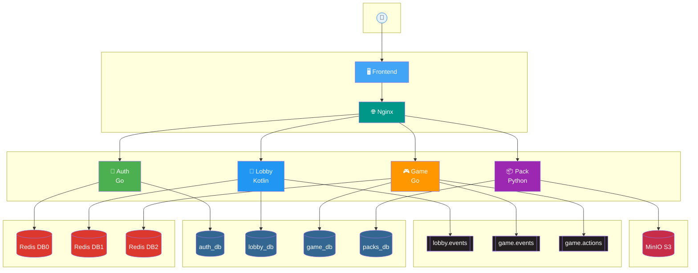
```mermaid
flowchart TB
    subgraph LAYER1 [" "]
        USER((👤))
    end

    subgraph LAYER2 [" "]
        direction LR
        FE[🖥️ Frontend]
        NGINX[🌐 Nginx]
    end

    subgraph LAYER3 [" "]
        direction LR
        AUTH[🔐 Auth<br/>Go]
        LOBBY[🚪 Lobby<br/>Kotlin]
        GAME[🎮 Game<br/>Go]
        PACK[📦 Pack<br/>Python]
    end

    subgraph LAYER4 [" "]
        direction LR
        DB1[(auth_db)]
        DB2[(lobby_db)]
        DB3[(game_db)]
        DB4[(packs_db)]
    end

    subgraph LAYER5 [" "]
        direction LR
        REDIS0[(Redis DB0)]
        REDIS1[(Redis DB1)]
        REDIS2[(Redis DB2)]
    end

    subgraph LAYER6 [" "]
        direction LR
        KAFKA1[[lobby.events]]
        KAFKA2[[game.events]]
        KAFKA3[[game.actions]]
    end

    subgraph LAYER7 [" "]
        MINIO[(MinIO S3)]
    end

    USER --> FE
    FE --> NGINX
    NGINX --> AUTH & LOBBY & GAME & PACK

    AUTH --> DB1
    LOBBY --> DB2
    GAME --> DB3
    PACK --> DB4

    AUTH --> REDIS0
    LOBBY --> REDIS1
    GAME --> REDIS2

    LOBBY --> KAFKA1
    GAME --> KAFKA2
    GAME --> KAFKA3

    PACK --> MINIO

    style USER fill:#E3F2FD,stroke:#1976D2
    style FE fill:#42A5F5,color:#fff
    style NGINX fill:#009688,color:#fff
    style AUTH fill:#4CAF50,color:#fff
    style LOBBY fill:#2196F3,color:#fff
    style GAME fill:#FF9800,color:#fff
    style PACK fill:#9C27B0,color:#fff
    style REDIS0 fill:#DC382D,color:#fff
    style REDIS1 fill:#DC382D,color:#fff
    style REDIS2 fill:#DC382D,color:#fff
    style KAFKA1 fill:#231F20,color:#fff
    style KAFKA2 fill:#231F20,color:#fff
    style KAFKA3 fill:#231F20,color:#fff
    style MINIO fill:#C72C48,color:#fff
    style DB1 fill:#336791,color:#fff
    style DB2 fill:#336791,color:#fff
    style DB3 fill:#336791,color:#fff
    style DB4 fill:#336791,color:#fff
```

### 2.1.1 Компоненты по слоям

| Слой | Компоненты | Порты |
|------|------------|-------|
| **👤 Клиент** | Браузер пользователя | — |
| **🖥️ Frontend** | React SPA | :80 |
| **🌐 Proxy** | Nginx (балансировка, SSL) | :80, :443 |
| **⚙️ Сервисы** | Auth, Lobby, Game, Pack | :8001-8005 |
| **🗄️ PostgreSQL** | 4 базы данных | :5432 |
| **⚡ Redis** | 3 логические БД (DB0, DB1, DB2) | :6379 |
| **📨 Kafka** | 3 топика | :9092 |
| **📁 MinIO** | S3 хранилище | :9000 |

### 2.1.2 Redis — разделение по базам

| Сервис | Redis DB | Назначение |
|--------|----------|------------|
| **Auth** | DB 0 | Сессии, refresh токены, blacklist |
| **Lobby** | DB 1 | Кеш комнат, онлайн статус |
| **Game** | DB 2 | Состояние игр, WS сессии, RTT данные |


### 2.1.3 Kafka — топики

| Топик | Producer | Consumer | Назначение |
|-------|----------|----------|------------|
| `lobby.events` | Lobby | Game | События комнат |
| `game.events` | Game | Lobby | События игры |
| `game.actions` | Game | Game (replay) | Действия игроков |

**Детализация потоков:**

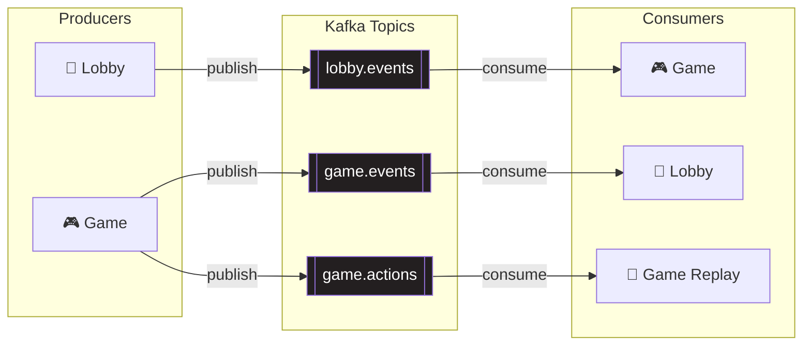
```mermaid
flowchart LR
    subgraph producers [Producers]
        LOBBY[🚪 Lobby]
        GAME[🎮 Game]
    end

    subgraph kafka [Kafka Topics]
        T1[[lobby.events]]
        T2[[game.events]]
        T3[[game.actions]]
    end

    subgraph consumers [Consumers]
        GAME2[🎮 Game]
        LOBBY2[🚪 Lobby]
        REPLAY[📼 Game Replay]
    end

    LOBBY -->|publish| T1
    GAME -->|publish| T2
    GAME -->|publish| T3

    T1 -->|consume| GAME2
    T2 -->|consume| LOBBY2
    T3 -->|consume| REPLAY

    style T1 fill:#231F20,color:#fff
    style T2 fill:#231F20,color:#fff
    style T3 fill:#231F20,color:#fff
```

| Топик | События | Кто пишет | Кто читает | Зачем читает |
|-------|---------|-----------|------------|--------------|
| `lobby.events` | ROOM_CREATED, PLAYER_JOINED, PLAYER_LEFT, ROOM_STARTED | Lobby | **Game** | Узнать о старте игры, получить список игроков |
| `game.events` | GAME_FINISHED, SCORES_UPDATED | Game | **Lobby** | Обновить статус комнаты на "finished" |
| `game.actions` | QUESTION_SELECTED, BUTTON_PRESSED, ANSWER_SUBMITTED | Game | **Game** | Сохранение для replay/аналитики |

### 2.2 Связи между сервисами

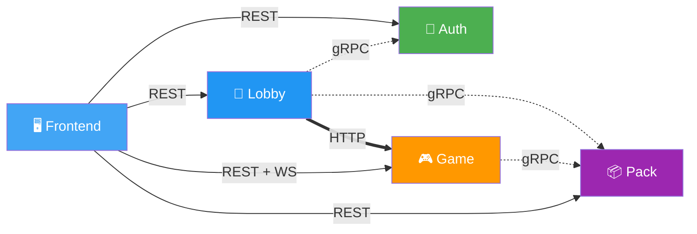
```mermaid
flowchart LR
    %% Frontend к сервисам
    FE[🖥️ Frontend]
    
    FE -->|REST| AUTH
    FE -->|REST| LOBBY  
    FE -->|REST + WS| GAME
    FE -->|REST| PACK

    %% Сервисы
    AUTH[🔐 Auth]
    LOBBY[🚪 Lobby]
    GAME[🎮 Game]
    PACK[📦 Pack]

    %% Внутренние связи (gRPC)
    LOBBY -.->|gRPC| AUTH
    LOBBY -.->|gRPC| PACK
    GAME -.->|gRPC| PACK

    %% HTTP между сервисами
    LOBBY ==>|HTTP| GAME

    %% Стили
    style FE fill:#42A5F5,color:#fff
    style AUTH fill:#4CAF50,color:#fff
    style LOBBY fill:#2196F3,color:#fff
    style GAME fill:#FF9800,color:#fff
    style PACK fill:#9C27B0,color:#fff
```

**Легенда:**
- `───▶` REST/HTTP (синхронные запросы от Frontend)
- `- - ▶` gRPC (внутренние синхронные вызовы)
- `═══▶` HTTP (Lobby → Game при старте игры)

**Протоколы взаимодействия:**

| Источник | Назначение | Протокол | Описание |
|----------|------------|----------|----------|
| Frontend | Auth | REST | Регистрация, логин, токены |
| Frontend | Lobby | REST | Управление комнатами |
| Frontend | Game | REST + WS | Создание игры + real-time |
| Frontend | Pack | REST | Получение паков |
| Lobby | Auth | gRPC | Валидация токенов |
| Lobby | Pack | gRPC | Проверка существования пака |
| Lobby | Game | HTTP | Создание игровой сессии |
| Game | Pack | gRPC | Загрузка контента пака |

### 2.3 Порты сервисов

| Сервис | HTTP | gRPC | WebSocket |
|--------|------|------|-----------|
| Auth | 8001 | 50051 | — |
| Lobby | 8002 | — | — |
| Game | 8003 | 50053 | 8083 |
| Pack | 8005 | 50055 | — |

---

## ✅ 3. Функциональные требования

[⬆️ К оглавлению](#-оглавление)

### 3.1 Аутентификация (FR-AUTH)

#### 🔴 High (MVP)
- [ ] **FR-AUTH-01** — Регистрация с уникальным username и паролем
- [ ] **FR-AUTH-02** — Вход по username/password
- [ ] **FR-AUTH-03** — JWT access token (1 час) + refresh token (7 дней)
- [ ] **FR-AUTH-04** — Обновление токенов по refresh token

#### 🟡 Medium
- [ ] **FR-AUTH-05** — Выход из системы (инвалидация токенов)
- [ ] **FR-AUTH-10** — Загрузка/изменение аватарки
- [ ] **FR-AUTH-11** — Отображение аватарки в лобби, комнате и игре

#### 🟢 Low (после MVP)
- [ ] **FR-AUTH-06** — Проверка доступности username до регистрации
- [ ] **FR-AUTH-07** — OAuth вход через Яндекс ID
- [ ] **FR-AUTH-08** — OAuth вход через VK ID
- [ ] **FR-AUTH-09** — OAuth вход через Google

### 3.2 Управление комнатами (FR-LOBBY)

#### 🔴 High (MVP)
- [ ] **FR-LOBBY-01** — Создание игровой комнаты
- [ ] **FR-LOBBY-02** — Присоединение к комнате по коду
- [ ] **FR-LOBBY-03** — Просмотр списка публичных комнат
- [ ] **FR-LOBBY-05** — Запуск игры хостом (мин. 2 игрока)
- [ ] **FR-LOBBY-08** — Выход из комнаты

#### 🟡 Medium
- [ ] **FR-LOBBY-04** — Настройка параметров игры (время, штрафы)
- [ ] **FR-LOBBY-06** — Кик игрока из комнаты
- [ ] **FR-LOBBY-07** — Приватная комната (с паролем)

### 3.3 Игровой процесс (FR-GAME)

#### 🔴 High (MVP)
- [ ] **FR-GAME-01** — Подключение игроков через WebSocket
- [ ] **FR-GAME-02** — Выбор вопроса на доске (игрок или ведущий)
- [ ] **FR-GAME-03** — Нажатие кнопки для ответа
- [ ] **FR-GAME-04** — Определение первого нажавшего (с компенсацией пинга)
- [ ] **FR-GAME-05** — Оценка ответа ведущим (верно/неверно)
- [ ] **FR-GAME-06** — Начисление/списание очков
- [ ] **FR-GAME-07** — Переход между раундами
- [ ] **FR-GAME-08** — Финальные результаты

#### 🟢 Low (после MVP)
- [ ] **FR-GAME-09** — Режим зрителя (наблюдение без участия)

### 3.4 Паки вопросов (FR-PACK)

#### 🔴 High (MVP)
- [ ] **FR-PACK-01** — Загрузка SIQ файла
- [ ] **FR-PACK-02** — Парсинг и валидация SIQ
- [ ] **FR-PACK-03** — Просмотр списка своих паков
- [ ] **FR-PACK-04** — Выбор пака при создании комнаты
- [ ] **FR-PACK-05** — Поддержка медиа (изображения, аудио, видео)

#### 🟡 Medium
- [ ] **FR-PACK-06** — Удаление своего пака

> **Примечание:** Общего каталога паков нет. Каждый пользователь загружает и использует только свои SIQ файлы.

---

## ⚡ 4. Нефункциональные требования

[⬆️ К оглавлению](#-оглавление)

### 4.1 Производительность (NFR-PERF)

| ID | Требование | Метрика |
|----|------------|---------|
| NFR-PERF-01 | Время ответа REST API | < 200ms (p95) |
| NFR-PERF-02 | Задержка WebSocket сообщений | < 50ms (p95) |
| NFR-PERF-03 | Одновременные игровые сессии | до 50 |
| NFR-PERF-04 | Игроков в одной комнате | 2-12 |
| NFR-PERF-05 | Запросов в секунду (RPS) | до 500 |
| NFR-PERF-06 | Время загрузки Frontend | < 1.5 сек |

### 4.2 Доступность (NFR-AVAIL)

| ID | Требование | Метрика |
|----|------------|---------|
| NFR-AVAIL-01 | Uptime системы | 99.9% |
| NFR-AVAIL-02 | Время восстановления (RTO) | < 5 мин |
| NFR-AVAIL-03 | Резервное копирование БД | Ежедневно |
| NFR-AVAIL-04 | Хранение бэкапов | 30 дней |

### 4.3 Безопасность (NFR-SEC)

| ID | Требование | Реализация |
|----|------------|------------|
| NFR-SEC-01 | Аутентификация | JWT + Refresh токены |
| NFR-SEC-02 | Защита от брутфорса | Rate limiting (см. 4.4) |
| NFR-SEC-03 | Хранение паролей | bcrypt (cost=12) |
| NFR-SEC-04 | Шифрование трафика | HTTPS/WSS в production |
| NFR-SEC-05 | Валидация входных данных | На всех уровнях |
| NFR-SEC-06 | Защита от XSS/CSRF | CSP headers, SameSite cookies |

### 4.4 Rate Limiting (NFR-RATE)

**Реализация:** Nginx (по IP)

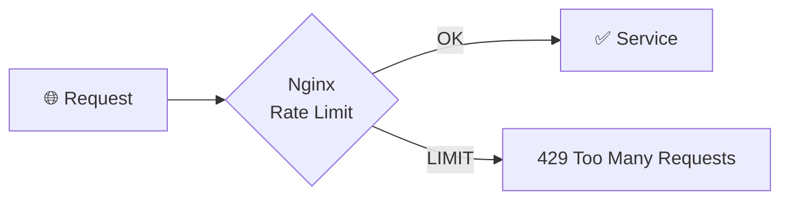
```mermaid
flowchart LR
    REQ[🌐 Request] --> NGINX{Nginx<br/>Rate Limit}
    NGINX -->|OK| SERVICE[✅ Service]
    NGINX -->|LIMIT| ERR[429 Too Many Requests]
```

Защита от DDoS и брутфорса на уровне Nginx — до того как запрос дойдёт до сервисов.

```nginx
http {
    # Зоны rate limiting
    limit_req_zone $binary_remote_addr zone=api_general:10m rate=30r/s;
    limit_req_zone $binary_remote_addr zone=api_auth:10m rate=5r/s;
    limit_req_zone $binary_remote_addr zone=api_upload:10m rate=1r/s;
    
    server {
        # Общий API
        location /api/ {
            limit_req zone=api_general burst=50 nodelay;
            proxy_pass http://backend;
        }
        
        # Auth (строже)
        location /api/auth/ {
            limit_req zone=api_auth burst=10 nodelay;
            proxy_pass http://auth-service:8001;
        }
        
        # Upload (очень строго)
        location /api/packs/upload {
            limit_req zone=api_upload burst=3 nodelay;
            proxy_pass http://pack-service:8005;
        }
    }
}
```

| Зона | Лимит | Burst | Назначение |
|------|-------|-------|------------|
| `api_general` | 30 r/s | 50 | Общие запросы |
| `api_auth` | 5 r/s | 10 | Аутентификация |
| `api_upload` | 1 r/s | 3 | Загрузка файлов |

#### Ответ при превышении лимита

```json
{
  "error": "RATE_LIMIT_EXCEEDED",
  "message": "Too many requests",
  "retry_after": 180
}
```

```http
HTTP/1.1 429 Too Many Requests
Retry-After: 180
X-RateLimit-Limit: 5
X-RateLimit-Remaining: 0
```

### 4.5 Масштабируемость (NFR-SCALE)

| ID | Требование | Описание |
|----|------------|----------|
| NFR-SCALE-01 | Горизонтальное масштабирование | Сервисы stateless, масштабируются независимо |
| NFR-SCALE-02 | Сессии в Redis | Позволяет балансировку между инстансами |
| NFR-SCALE-03 | Очереди в Kafka | Асинхронная обработка событий |

### 4.6 Совместимость (NFR-COMPAT)

| ID | Требование | Описание |
|----|------------|----------|
| NFR-COMPAT-01 | Браузеры | Chrome, Firefox, Safari, Edge (последние 2 версии) |
| NFR-COMPAT-02 | Мобильные | Адаптивная вёрстка (responsive) |
| NFR-COMPAT-03 | Формат паков | SIQ v5 (стандарт SIGame) |

---

## 👥 5. Сценарии пользователей

[⬆️ К оглавлению](#-оглавление)

### 5.1 Регистрация и вход

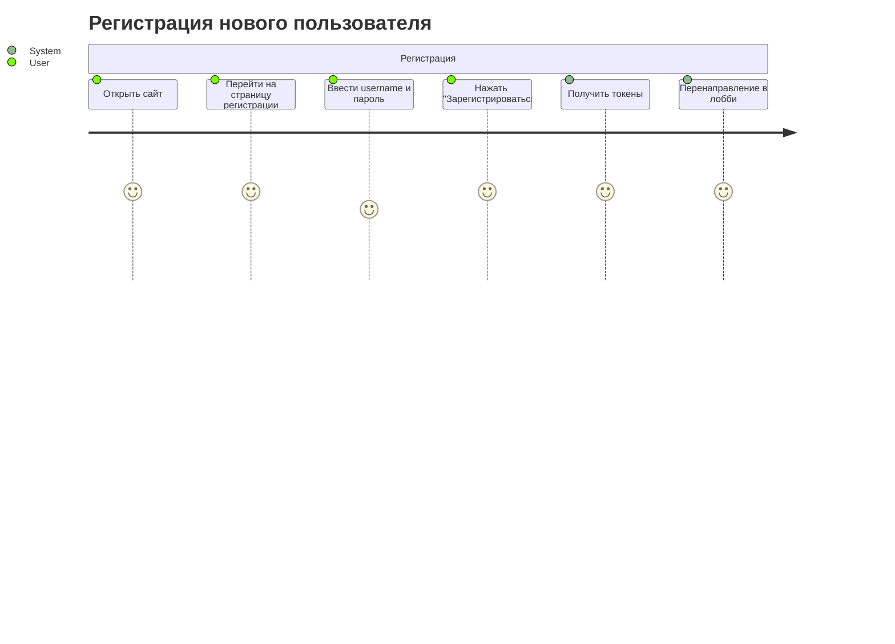
```mermaid
journey
    title Регистрация нового пользователя
    section Регистрация
      Открыть сайт: 5: User
      Перейти на страницу регистрации: 5: User
      Ввести username и пароль: 4: User
      Нажать "Зарегистрироваться": 5: User
      Получить токены: 5: System
      Перенаправление в лобби: 5: System
```

| UC-01 | Регистрация |
|-------|-------------|
| **Актор** | Новый пользователь |
| **Предусловие** | Пользователь не авторизован |
| **Основной сценарий** | 1. Открыть `/register`<br/>2. Ввести username (5-50 символов)<br/>3. Ввести пароль (мин. 8 символов)<br/>4. Нажать "Зарегистрироваться"<br/>5. Система создаёт аккаунт и выдаёт токены<br/>6. Редирект в `/lobby` |
| **Альтернативный** | 4a. Username занят → показать ошибку |
| **Постусловие** | Пользователь авторизован |

---

### 5.2 Создание и запуск игры

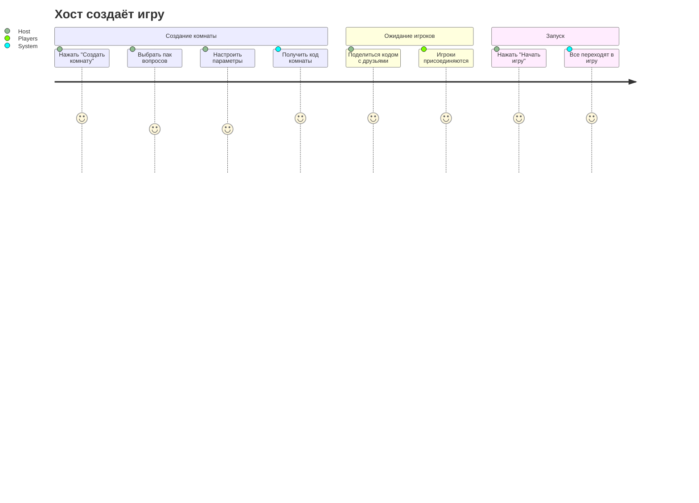
```mermaid
journey
    title Хост создаёт игру
    section Создание комнаты
      Нажать "Создать комнату": 5: Host
      Выбрать пак вопросов: 4: Host
      Настроить параметры: 4: Host
      Получить код комнаты: 5: System
    section Ожидание игроков
      Поделиться кодом с друзьями: 5: Host
      Игроки присоединяются: 5: Players
    section Запуск
      Нажать "Начать игру": 5: Host
      Все переходят в игру: 5: System
```

| UC-02 | Создание игры |
|-------|---------------|
| **Актор** | Хост (создатель) |
| **Предусловие** | Пользователь авторизован |
| **Основной сценарий** | 1. Нажать "Создать комнату"<br/>2. Выбрать пак вопросов<br/>3. Настроить параметры (время, штрафы)<br/>4. Нажать "Создать"<br/>5. Система генерирует код комнаты (ABC123)<br/>6. Поделиться кодом с игроками<br/>7. Дождаться мин. 2 игроков<br/>8. Нажать "Начать игру" |
| **Постусловие** | Игра запущена, все в WebSocket |

---

### 5.3 Присоединение к игре

| UC-03 | Присоединение по коду |
|-------|----------------------|
| **Актор** | Игрок |
| **Предусловие** | Пользователь авторизован, знает код комнаты |
| **Основной сценарий** | 1. Ввести код комнаты (ABC123)<br/>2. Нажать "Присоединиться"<br/>3. Если комната приватная — ввести пароль<br/>4. Попасть в комнату ожидания<br/>5. Дождаться старта игры |
| **Альтернативный** | 2a. Комната не найдена → ошибка<br/>2b. Комната заполнена → ошибка |
| **Постусловие** | Игрок в комнате |

---

### 5.4 Игровой процесс

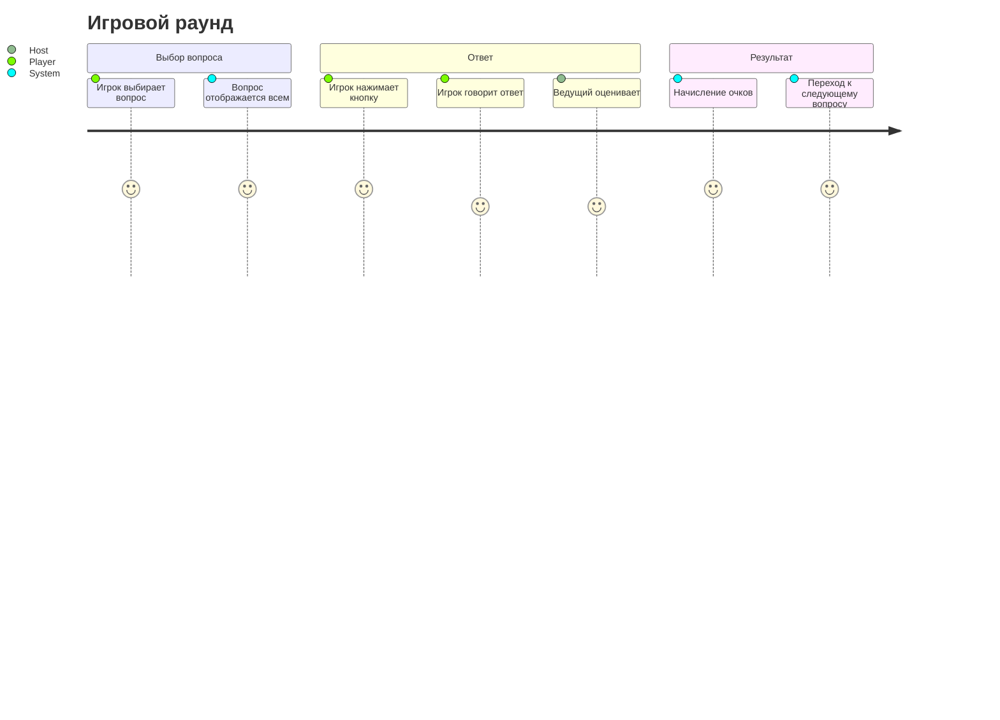
```mermaid
journey
    title Игровой раунд
    section Выбор вопроса
      Игрок выбирает вопрос: 5: Player
      Вопрос отображается всем: 5: System
    section Ответ
      Игрок нажимает кнопку: 5: Player
      Игрок говорит ответ: 4: Player
      Ведущий оценивает: 4: Host
    section Результат
      Начисление очков: 5: System
      Переход к следующему вопросу: 5: System
```

| UC-04 | Ответ на вопрос |
|-------|-----------------|
| **Актор** | Игрок |
| **Предусловие** | Игра запущена, вопрос на экране |
| **Основной сценарий** | 1. Игрок нажимает кнопку "Ответить"<br/>2. Система фиксирует первого нажавшего<br/>3. Игрок озвучивает ответ<br/>4. Ведущий нажимает "Верно" или "Неверно"<br/>5. Система начисляет/списывает очки |
| **Альтернативный** | 3a. Таймаут ответа → ход переходит<br/>4a. Неверный ответ → штраф (если включён) |
| **Постусловие** | Очки обновлены |

---

### 5.5 Загрузка пака вопросов

| UC-05 | Загрузка SIQ пака |
|-------|-------------------|
| **Актор** | Пользователь |
| **Предусловие** | Пользователь авторизован, имеет .siq файл |
| **Основной сценарий** | 1. Перейти в раздел "Паки"<br/>2. Нажать "Загрузить"<br/>3. Выбрать .siq файл (до 100MB)<br/>4. Система парсит файл<br/>5. Пак появляется в списке со статусом "Processing"<br/>6. После обработки статус меняется на "Approved" |
| **Альтернативный** | 4a. Невалидный файл → ошибка с описанием |
| **Постусловие** | Пак доступен для выбора |

---

## 🔄 6. Flow-диаграммы

[⬆️ К оглавлению](#-оглавление)

### 6.1 Регистрация и логин

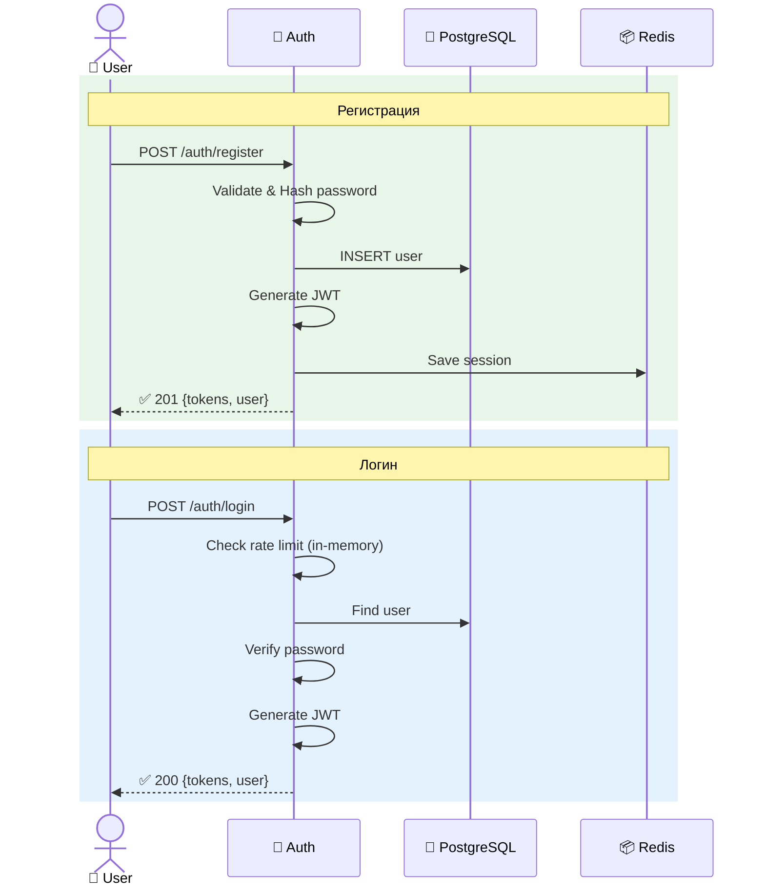
```mermaid
sequenceDiagram
    actor U as 👤 User
    participant A as 🔐 Auth
    participant DB as 💾 PostgreSQL
    participant R as 📦 Redis

    rect rgb(232, 245, 233)
        Note over U,R: Регистрация
        U->>A: POST /auth/register
        A->>A: Validate & Hash password
        A->>DB: INSERT user
        A->>A: Generate JWT
        A->>R: Save session
        A-->>U: ✅ 201 {tokens, user}
    end

    rect rgb(227, 242, 253)
        Note over U,R: Логин
        U->>A: POST /auth/login
        A->>A: Check rate limit (in-memory)
        A->>DB: Find user
        A->>A: Verify password
        A->>A: Generate JWT
        A-->>U: ✅ 200 {tokens, user}
    end
```

### 6.2 Создание комнаты и старт игры

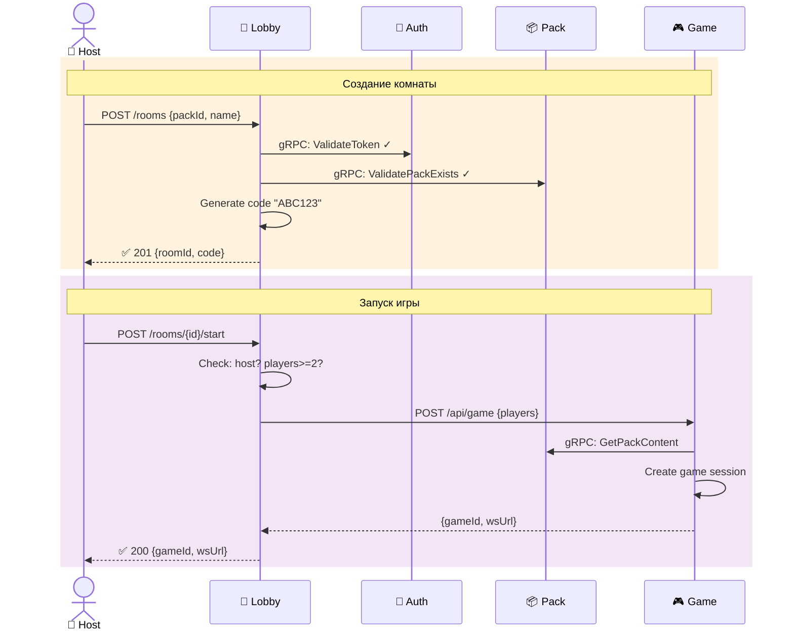
```mermaid
sequenceDiagram
    actor U as 👤 Host
    participant L as 🚪 Lobby
    participant A as 🔐 Auth
    participant P as 📦 Pack
    participant G as 🎮 Game

    rect rgb(255, 243, 224)
        Note over U,G: Создание комнаты
        U->>L: POST /rooms {packId, name}
        L->>A: gRPC: ValidateToken ✓
        L->>P: gRPC: ValidatePackExists ✓
        L->>L: Generate code "ABC123"
        L-->>U: ✅ 201 {roomId, code}
    end

    rect rgb(243, 229, 245)
        Note over U,G: Запуск игры
        U->>L: POST /rooms/{id}/start
        L->>L: Check: host? players>=2?
        L->>G: POST /api/game {players}
        G->>P: gRPC: GetPackContent
        G->>G: Create game session
        G-->>L: {gameId, wsUrl}
        L-->>U: ✅ 200 {gameId, wsUrl}
    end
```

### 6.3 Игровой процесс (WebSocket)

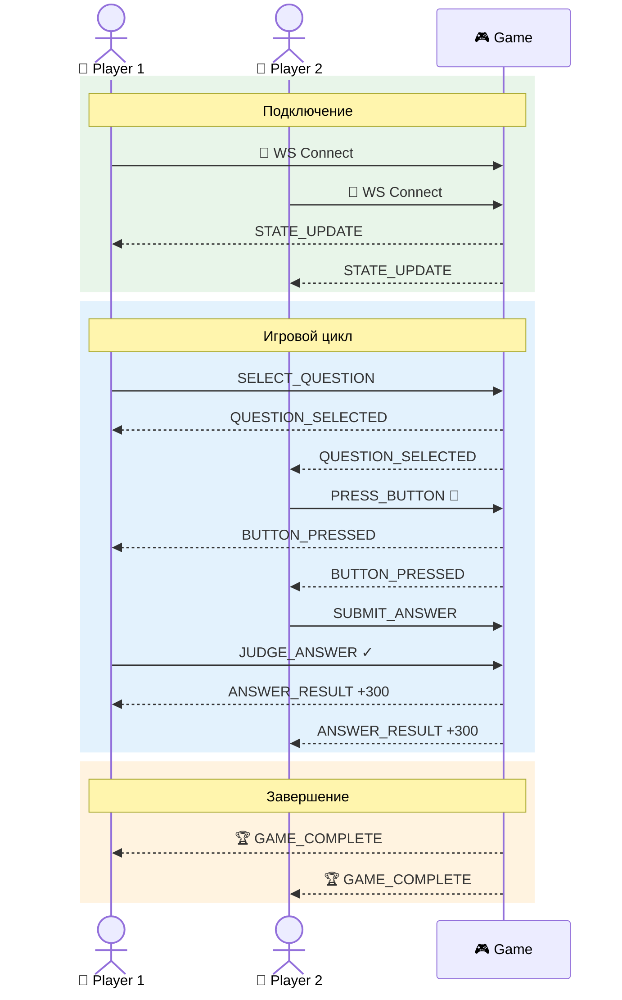
```mermaid
sequenceDiagram
    actor P1 as 👤 Player 1
    actor P2 as 👤 Player 2
    participant G as 🎮 Game

    rect rgb(232, 245, 233)
        Note over P1,G: Подключение
        P1->>G: 🔌 WS Connect
        P2->>G: 🔌 WS Connect
        G-->>P1: STATE_UPDATE
        G-->>P2: STATE_UPDATE
    end

    rect rgb(227, 242, 253)
        Note over P1,G: Игровой цикл
        P1->>G: SELECT_QUESTION
        G-->>P1: QUESTION_SELECTED
        G-->>P2: QUESTION_SELECTED
        
        P2->>G: PRESS_BUTTON 🔴
        G-->>P1: BUTTON_PRESSED
        G-->>P2: BUTTON_PRESSED
        
        P2->>G: SUBMIT_ANSWER
        P1->>G: JUDGE_ANSWER ✓
        G-->>P1: ANSWER_RESULT +300
        G-->>P2: ANSWER_RESULT +300
    end

    rect rgb(255, 243, 224)
        Note over P1,G: Завершение
        G-->>P1: 🏆 GAME_COMPLETE
        G-->>P2: 🏆 GAME_COMPLETE
    end
```

---

<br>

# 📗 ЧАСТЬ II: ДАННЫЕ

---

## 💾 7. База данных

[⬆️ К оглавлению](#-оглавление)

### 7.1 Auth DB

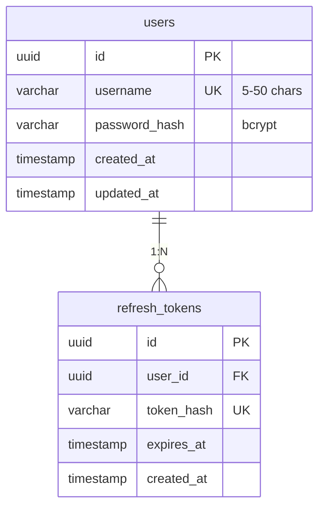
```mermaid
erDiagram
    users ||--o{ refresh_tokens : "1:N"
    
    users {
        uuid id PK
        varchar username UK "5-50 chars"
        varchar password_hash "bcrypt"
        timestamp created_at
        timestamp updated_at
    }
    
    refresh_tokens {
        uuid id PK
        uuid user_id FK
        varchar token_hash UK
        timestamp expires_at
        timestamp created_at
    }
```

**Индексы:**
- `idx_users_username` — поиск по username
- `idx_refresh_tokens_user_id` — токены пользователя
- `idx_refresh_tokens_expires_at` — очистка истёкших

---

### 7.2 Lobby DB

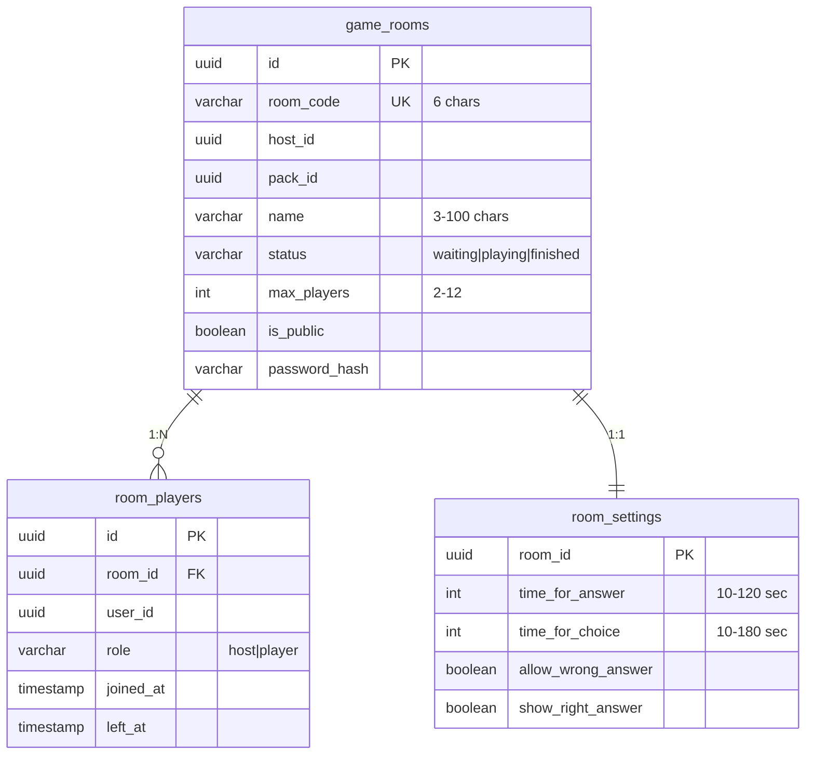
```mermaid
erDiagram
    game_rooms ||--o{ room_players : "1:N"
    game_rooms ||--|| room_settings : "1:1"
    
    game_rooms {
        uuid id PK
        varchar room_code UK "6 chars"
        uuid host_id
        uuid pack_id
        varchar name "3-100 chars"
        varchar status "waiting|playing|finished"
        int max_players "2-12"
        boolean is_public
        varchar password_hash
    }
    
    room_players {
        uuid id PK
        uuid room_id FK
        uuid user_id
        varchar role "host|player"
        timestamp joined_at
        timestamp left_at
    }
    
    room_settings {
        uuid room_id PK
        int time_for_answer "10-120 sec"
        int time_for_choice "10-180 sec"
        boolean allow_wrong_answer
        boolean show_right_answer
    }
```

**Статусы комнаты:**
| Статус | Описание |
|--------|----------|
| `waiting` | Ожидание игроков |
| `starting` | Запуск игры |
| `playing` | Игра идёт |
| `finished` | Завершена |
| `cancelled` | Отменена |

---

### 7.3 Game DB

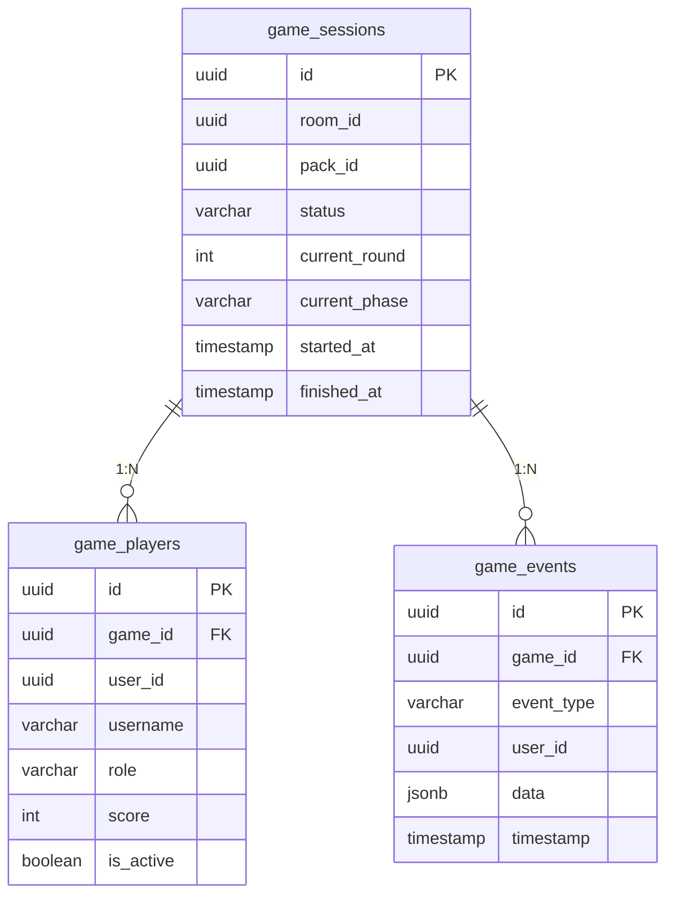
```mermaid
erDiagram
    game_sessions ||--o{ game_players : "1:N"
    game_sessions ||--o{ game_events : "1:N"
    
    game_sessions {
        uuid id PK
        uuid room_id
        uuid pack_id
        varchar status
        int current_round
        varchar current_phase
        timestamp started_at
        timestamp finished_at
    }
    
    game_players {
        uuid id PK
        uuid game_id FK
        uuid user_id
        varchar username
        varchar role
        int score
        boolean is_active
    }
    
    game_events {
        uuid id PK
        uuid game_id FK
        varchar event_type
        uuid user_id
        jsonb data
        timestamp timestamp
    }
```

---

### 7.4 Packs DB

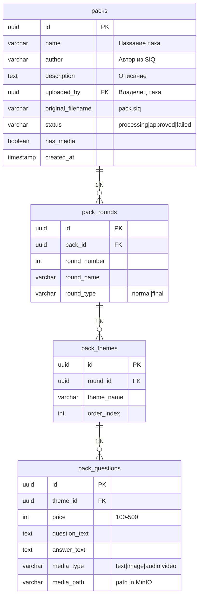
```mermaid
erDiagram
    packs ||--o{ pack_rounds : "1:N"
    pack_rounds ||--o{ pack_themes : "1:N"
    pack_themes ||--o{ pack_questions : "1:N"
    
    packs {
        uuid id PK
        varchar name "Название пака"
        varchar author "Автор из SIQ"
        text description "Описание"
        uuid uploaded_by FK "Владелец пака"
        varchar original_filename "pack.siq"
        varchar status "processing|approved|failed"
        boolean has_media
        timestamp created_at
    }
    
    pack_rounds {
        uuid id PK
        uuid pack_id FK
        int round_number
        varchar round_name
        varchar round_type "normal|final"
    }
    
    pack_themes {
        uuid id PK
        uuid round_id FK
        varchar theme_name
        int order_index
    }
    
    pack_questions {
        uuid id PK
        uuid theme_id FK
        int price "100-500"
        text question_text
        text answer_text
        varchar media_type "text|image|audio|video"
        varchar media_path "path in MinIO"
    }
    
```

**Статусы пака:**
| Статус | Описание |
|--------|----------|
| `processing` | Файл загружен, идёт парсинг |
| `approved` | Пак готов к использованию |
| `failed` | Ошибка обработки |

---

## 🎲 8. Game State Machine

[⬆️ К оглавлению](#-оглавление)

> **Это ядро игры.** Стейт-машина управляет всем игровым процессом: фазами, таймерами, переходами, очками.

### 8.1 Диаграмма состояний

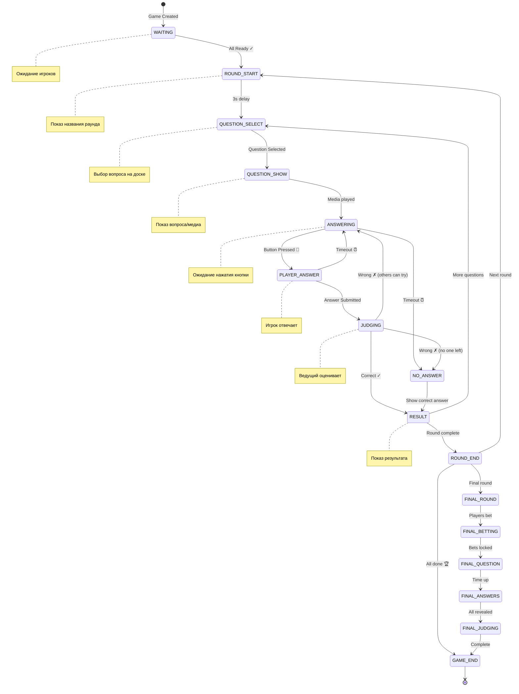
```mermaid
stateDiagram-v2
    [*] --> WAITING: Game Created
    
    WAITING --> ROUND_START: All Ready ✓
    note right of WAITING: Ожидание игроков
    
    ROUND_START --> QUESTION_SELECT: 3s delay
    note right of ROUND_START: Показ названия раунда
    
    QUESTION_SELECT --> QUESTION_SHOW: Question Selected
    note right of QUESTION_SELECT: Выбор вопроса на доске
    
    QUESTION_SHOW --> ANSWERING: Media played
    note right of QUESTION_SHOW: Показ вопроса/медиа
    
    ANSWERING --> PLAYER_ANSWER: Button Pressed 🔴
    ANSWERING --> NO_ANSWER: Timeout ⏰
    note right of ANSWERING: Ожидание нажатия кнопки
    
    PLAYER_ANSWER --> JUDGING: Answer Submitted
    PLAYER_ANSWER --> ANSWERING: Timeout ⏰
    note right of PLAYER_ANSWER: Игрок отвечает
    
    JUDGING --> RESULT: Correct ✓
    JUDGING --> ANSWERING: Wrong ✗ (others can try)
    JUDGING --> NO_ANSWER: Wrong ✗ (no one left)
    note right of JUDGING: Ведущий оценивает
    
    NO_ANSWER --> RESULT: Show correct answer
    
    RESULT --> QUESTION_SELECT: More questions
    RESULT --> ROUND_END: Round complete
    note right of RESULT: Показ результата
    
    ROUND_END --> ROUND_START: Next round
    ROUND_END --> FINAL_ROUND: Final round
    ROUND_END --> GAME_END: All done 🏆
    
    FINAL_ROUND --> FINAL_BETTING: Players bet
    FINAL_BETTING --> FINAL_QUESTION: Bets locked
    FINAL_QUESTION --> FINAL_ANSWERS: Time up
    FINAL_ANSWERS --> FINAL_JUDGING: All revealed
    FINAL_JUDGING --> GAME_END: Complete
    
    GAME_END --> [*]
```

### 8.2 Описание состояний

| Состояние | Описание | Таймер | Действия при входе |
|-----------|----------|--------|-------------------|
| `WAITING` | Ожидание готовности всех игроков | — | Broadcast `GAME_STATE` |
| `ROUND_START` | Показ названия раунда и тем | 3 сек | Broadcast `ROUND_START` |
| `QUESTION_SELECT` | Игрок выбирает вопрос на доске | 30 сек | Broadcast `SELECT_QUESTION` |
| `QUESTION_SHOW` | Отображение вопроса и медиа | По длительности медиа | Broadcast `QUESTION_CONTENT` |
| `ANSWERING` | Ожидание нажатия кнопки | `time_for_answer` (15-60 сек) | Broadcast `WAITING_BUTTON` |
| `PLAYER_ANSWER` | Выбранный игрок отвечает | 15 сек | Broadcast `PLAYER_ANSWERING` |
| `JUDGING` | Ведущий оценивает ответ | 30 сек | Broadcast `AWAITING_JUDGMENT` |
| `RESULT` | Показ правильного ответа и очков | 3 сек | Broadcast `ANSWER_RESULT` |
| `NO_ANSWER` | Никто не ответил | 3 сек | Broadcast `NO_ANSWER` |
| `ROUND_END` | Итоги раунда, таблица очков | 5 сек | Broadcast `ROUND_END` |
| `FINAL_ROUND` | Начало финального раунда | 10 сек | Broadcast `FINAL_ROUND_START` |
| `FINAL_BETTING` | Игроки делают ставки | 30 сек | Broadcast `MAKE_BET` |
| `FINAL_QUESTION` | Показ финального вопроса | 60 сек | Broadcast `FINAL_QUESTION` |
| `FINAL_ANSWERS` | Показ ответов по очереди | 10 сек/игрок | Broadcast `REVEAL_ANSWER` |
| `FINAL_JUDGING` | Оценка финальных ответов | 15 сек/игрок | Broadcast `FINAL_JUDGMENT` |
| `GAME_END` | Финальные результаты | — | Broadcast `GAME_COMPLETE` |

### 8.3 Таблица переходов

| Из состояния | В состояние | Триггер | Условие |
|--------------|-------------|---------|---------|
| `WAITING` | `ROUND_START` | `PLAYER_READY` | Все игроки ready |
| `ROUND_START` | `QUESTION_SELECT` | Timer | 3 сек истекло |
| `QUESTION_SELECT` | `QUESTION_SHOW` | `SELECT_QUESTION` | Валидный вопрос |
| `QUESTION_SELECT` | `QUESTION_SELECT` | Timer | Авто-выбор случайного |
| `QUESTION_SHOW` | `ANSWERING` | Timer / Media end | Медиа проиграно |
| `ANSWERING` | `PLAYER_ANSWER` | `PRESS_BUTTON` | Первый нажавший (ping compensated) |
| `ANSWERING` | `NO_ANSWER` | Timer | Никто не нажал |
| `PLAYER_ANSWER` | `JUDGING` | `SUBMIT_ANSWER` | Ответ отправлен |
| `PLAYER_ANSWER` | `ANSWERING` | Timer | Время на ответ вышло |
| `JUDGING` | `RESULT` | `JUDGE_ANSWER(correct)` | Ответ верный |
| `JUDGING` | `ANSWERING` | `JUDGE_ANSWER(wrong)` | Есть другие игроки |
| `JUDGING` | `NO_ANSWER` | `JUDGE_ANSWER(wrong)` | Больше некому отвечать |
| `RESULT` | `QUESTION_SELECT` | Timer | Есть ещё вопросы |
| `RESULT` | `ROUND_END` | Timer | Вопросы раунда закончились |
| `ROUND_END` | `ROUND_START` | Timer | Есть следующий раунд |
| `ROUND_END` | `FINAL_ROUND` | Timer | Следующий — финал |
| `ROUND_END` | `GAME_END` | Timer | Это был финал |

### 8.4 Специальные типы вопросов

#### 🐱 Кот в мешке (`secret`)

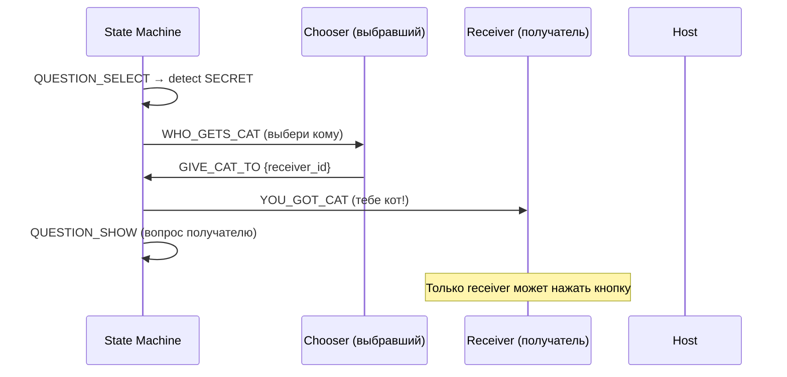
```mermaid
sequenceDiagram
    participant S as State Machine
    participant C as Chooser (выбравший)
    participant R as Receiver (получатель)
    participant H as Host
    
    S->>S: QUESTION_SELECT → detect SECRET
    S->>C: WHO_GETS_CAT (выбери кому)
    C->>S: GIVE_CAT_TO {receiver_id}
    S->>R: YOU_GOT_CAT (тебе кот!)
    S->>S: QUESTION_SHOW (вопрос получателю)
    Note over R: Только receiver может нажать кнопку
```

**Логика:**
1. Игрок выбирает вопрос → система определяет что это "Кот в мешке"
2. Игрок выбирает кому передать (кроме себя)
3. Только получатель может отвечать
4. Стоимость может быть фиксированной или выбираемой

#### 💰 Ва-банк (`stake`)

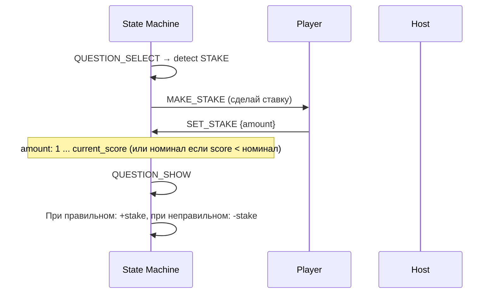
```mermaid
sequenceDiagram
    participant S as State Machine
    participant P as Player
    participant H as Host
    
    S->>S: QUESTION_SELECT → detect STAKE
    S->>P: MAKE_STAKE (сделай ставку)
    P->>S: SET_STAKE {amount}
    Note over S: amount: 1 ... current_score (или номинал если score < номинал)
    S->>S: QUESTION_SHOW
    S->>S: При правильном: +stake, при неправильном: -stake
```

**Правила ставки:**
- Минимум: номинал вопроса
- Максимум: текущий счёт игрока
- Если счёт < номинала: ставка = номинал

#### 🎯 Вопрос всем (`forAll`)

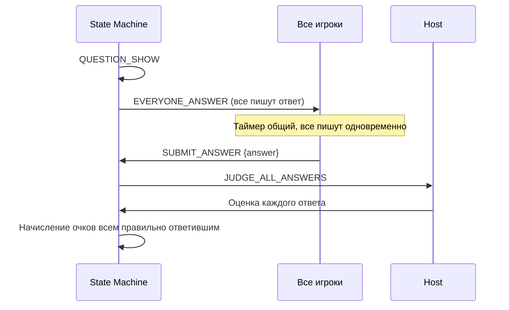
```mermaid
sequenceDiagram
    participant S as State Machine
    participant All as Все игроки
    participant H as Host
    
    S->>S: QUESTION_SHOW
    S->>All: EVERYONE_ANSWER (все пишут ответ)
    Note over All: Таймер общий, все пишут одновременно
    All->>S: SUBMIT_ANSWER {answer}
    S->>H: JUDGE_ALL_ANSWERS
    H->>S: Оценка каждого ответа
    S->>S: Начисление очков всем правильно ответившим
```

### 8.5 Система очков

| Ситуация | Изменение очков |
|----------|-----------------|
| Правильный ответ | `+price` |
| Неправильный ответ (штрафы вкл.) | `-price` |
| Неправильный ответ (штрафы выкл.) | `0` |
| Timeout при ответе | `0` |
| Ва-банк правильно | `+stake` |
| Ва-банк неправильно | `-stake` |
| Финал правильно | `+bet` |
| Финал неправильно | `-bet` |

### 8.6 Компенсация пинга (Ping Compensation)

> **Критически важно!** Без компенсации игрок с пингом 10ms всегда победит игрока с пингом 100ms.

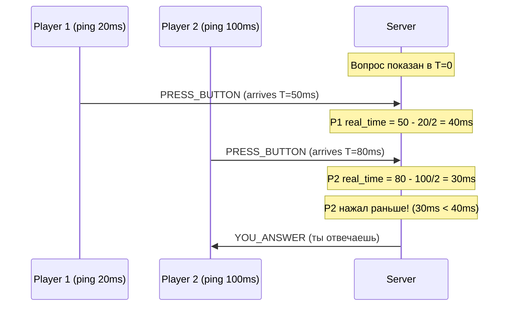
```mermaid
sequenceDiagram
    participant P1 as Player 1 (ping 20ms)
    participant P2 as Player 2 (ping 100ms)
    participant S as Server
    
    Note over S: Вопрос показан в T=0
    
    P1->>S: PRESS_BUTTON (arrives T=50ms)
    Note over S: P1 real_time = 50 - 20/2 = 40ms
    
    P2->>S: PRESS_BUTTON (arrives T=80ms)
    Note over S: P2 real_time = 80 - 100/2 = 30ms
    
    Note over S: P2 нажал раньше! (30ms < 40ms)
    S->>P2: YOU_ANSWER (ты отвечаешь)
```

**Формула:**
```
real_press_time = server_receive_time - (RTT / 2)
```

**Измерение RTT:**
```json
// Server → Client
{"type": "PING", "server_time": 1701234567890}

// Client → Server (сразу)
{"type": "PONG", "server_time": 1701234567890}

// Server вычисляет
RTT = now - server_time  // например 80ms
```

**Хранение:**
```go
type PlayerConnection struct {
    UserID    string
    RTT       time.Duration  // Скользящее среднее последних 5 измерений
    LastPing  time.Time
}
```

### 8.7 Таймеры и конфигурация

```go
type GameTimers struct {
    RoundStartDisplay   time.Duration // 3s - показ названия раунда
    QuestionSelectTime  time.Duration // 30s - время на выбор вопроса
    AnswerTime          time.Duration // 15-60s - время на нажатие кнопки (настраивается)
    PlayerAnswerTime    time.Duration // 15s - время на озвучивание ответа
    JudgingTime         time.Duration // 30s - время на оценку ведущим
    ResultDisplayTime   time.Duration // 3s - показ результата
    RoundEndDisplay     time.Duration // 5s - итоги раунда
    FinalBettingTime    time.Duration // 30s - ставки в финале
    FinalAnswerTime     time.Duration // 60s - ответ в финале
    FinalRevealTime     time.Duration // 10s - показ ответа игрока
}
```

### 8.8 Обработка дисконнектов

| Ситуация | Действие |
|----------|----------|
| Игрок отключился во время `ANSWERING` | Пропускает вопрос, игра продолжается |
| Игрок отключился во время `PLAYER_ANSWER` | Timeout, ход переходит к другим |
| Ведущий отключился | Пауза 60 сек, потом авто-judge или отмена |
| Все игроки отключились | Игра отменяется |
| Реконнект в течение 30 сек | Восстановление состояния |

### 8.9 События и WebSocket сообщения

**От сервера клиентам:**

| Событие | Когда | Payload |
|---------|-------|---------|
| `GAME_STATE` | При подключении / изменении | Полное состояние игры |
| `ROUND_START` | Начало раунда | `{round_number, round_name, themes}` |
| `SELECT_QUESTION` | Ожидание выбора | `{selector_id, board}` |
| `QUESTION_CONTENT` | Показ вопроса | `{question, media_urls}` |
| `WAITING_BUTTON` | Ожидание нажатия | `{timeout}` |
| `BUTTON_PRESSED` | Кто-то нажал | `{user_id, username}` |
| `PLAYER_ANSWERING` | Игрок отвечает | `{user_id, timeout}` |
| `ANSWER_RESULT` | Результат ответа | `{user_id, correct, answer, correct_answer, score_change}` |
| `SCORES_UPDATE` | Обновление очков | `{scores: [{user_id, score}]}` |
| `ROUND_END` | Конец раунда | `{scores, next_round}` |
| `GAME_COMPLETE` | Конец игры | `{winners, final_scores, duration}` |

**От клиентов серверу:**

| Событие | Когда | Payload |
|---------|-------|---------|
| `PLAYER_READY` | Готовность к игре | `{}` |
| `SELECT_QUESTION` | Выбор вопроса | `{round, theme, price}` |
| `PRESS_BUTTON` | Нажатие кнопки | `{}` |
| `SUBMIT_ANSWER` | Отправка ответа | `{answer}` |
| `JUDGE_ANSWER` | Оценка (только ведущий) | `{correct: bool}` |
| `MAKE_STAKE` | Ставка ва-банк | `{amount}` |
| `GIVE_CAT_TO` | Передача кота | `{receiver_id}` |

### 8.10 Пример полного цикла вопроса

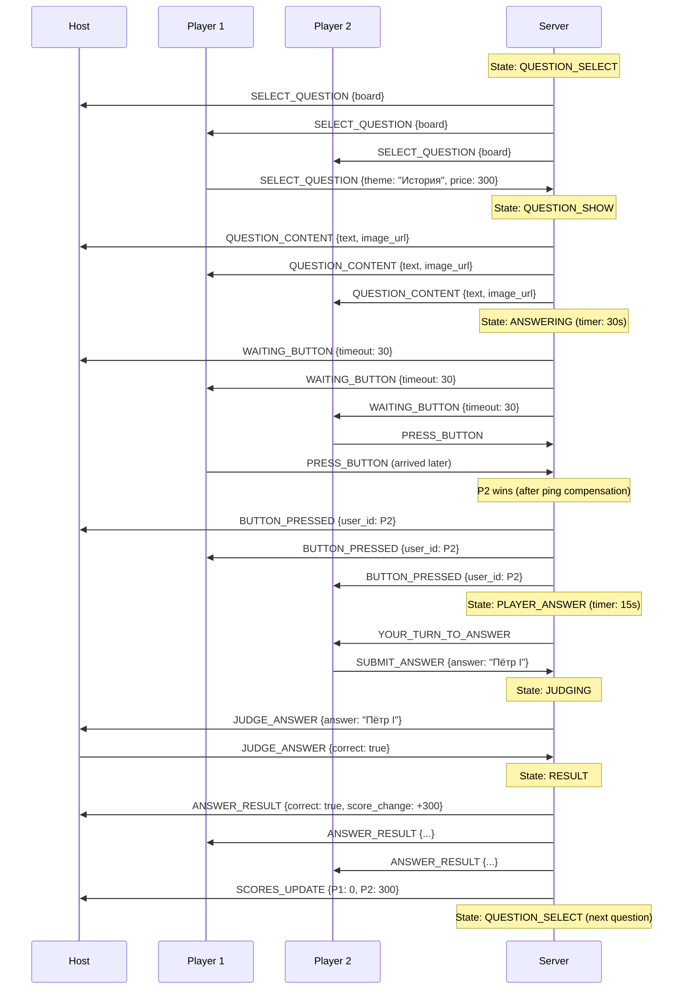
```mermaid
sequenceDiagram
    participant H as Host
    participant P1 as Player 1
    participant P2 as Player 2
    participant S as Server
    
    Note over S: State: QUESTION_SELECT
    S->>H: SELECT_QUESTION {board}
    S->>P1: SELECT_QUESTION {board}
    S->>P2: SELECT_QUESTION {board}
    
    P1->>S: SELECT_QUESTION {theme: "История", price: 300}
    
    Note over S: State: QUESTION_SHOW
    S->>H: QUESTION_CONTENT {text, image_url}
    S->>P1: QUESTION_CONTENT {text, image_url}
    S->>P2: QUESTION_CONTENT {text, image_url}
    
    Note over S: State: ANSWERING (timer: 30s)
    S->>H: WAITING_BUTTON {timeout: 30}
    S->>P1: WAITING_BUTTON {timeout: 30}
    S->>P2: WAITING_BUTTON {timeout: 30}
    
    P2->>S: PRESS_BUTTON
    P1->>S: PRESS_BUTTON (arrived later)
    Note over S: P2 wins (after ping compensation)
    
    S->>H: BUTTON_PRESSED {user_id: P2}
    S->>P1: BUTTON_PRESSED {user_id: P2}
    S->>P2: BUTTON_PRESSED {user_id: P2}
    
    Note over S: State: PLAYER_ANSWER (timer: 15s)
    S->>P2: YOUR_TURN_TO_ANSWER
    
    P2->>S: SUBMIT_ANSWER {answer: "Пётр I"}
    
    Note over S: State: JUDGING
    S->>H: JUDGE_ANSWER {answer: "Пётр I"}
    
    H->>S: JUDGE_ANSWER {correct: true}
    
    Note over S: State: RESULT
    S->>H: ANSWER_RESULT {correct: true, score_change: +300}
    S->>P1: ANSWER_RESULT {...}
    S->>P2: ANSWER_RESULT {...}
    
    S->>H: SCORES_UPDATE {P1: 0, P2: 300}
    
    Note over S: State: QUESTION_SELECT (next question)
```

### 8.11 Синхронизация медиа

> **Критически важно!** Все игроки должны видеть/слышать медиа одновременно (расхождение < 100ms).

#### Архитектура синхронизации

```mermaid
flowchart TB
    subgraph preload [📥 Pre-loading раунда]
        RS[ROUND_START] --> MANIFEST[Сервер отправляет манифест]
        MANIFEST --> DOWNLOAD[Клиенты загружают в фоне]
        DOWNLOAD --> PROGRESS[Отчёт о прогрессе]
        PROGRESS --> READY[Все загрузили ✓]
    end
    
    subgraph sync [⏱️ Синхронный старт]
        READY --> TIME_SYNC[Синхронизация часов]
        TIME_SYNC --> START_CMD[START_MEDIA + timestamp]
        START_CMD --> PLAY[Одновременный старт]
    end
```

#### 1. Pre-loading всего раунда

При переходе в `ROUND_START` сервер отправляет манифест всех медиа:

**Server → Clients:**
```json
{
  "type": "ROUND_MEDIA_MANIFEST",
  "round": 1,
  "media": [
    {
      "id": "r1_t1_q1_img",
      "type": "image",
      "url": "https://minio.example.com/packs/abc123/images/img1.png",
      "size": 150000,
      "question_ref": {"theme": 0, "price": 100}
    },
    {
      "id": "r1_t2_q3_audio",
      "type": "audio",
      "url": "https://minio.example.com/packs/abc123/audio/music1.mp3",
      "size": 2500000,
      "duration_ms": 15000,
      "question_ref": {"theme": 1, "price": 300}
    },
    {
      "id": "r1_t3_q5_video",
      "type": "video",
      "url": "https://minio.example.com/packs/abc123/video/clip1.mp4",
      "size": 8000000,
      "duration_ms": 30000,
      "question_ref": {"theme": 2, "price": 500}
    }
  ],
  "total_size": 15000000,
  "total_count": 25
}
```

**Client → Server (прогресс):**
```json
{"type": "MEDIA_LOAD_PROGRESS", "loaded": 12, "total": 25, "bytes_loaded": 7500000, "percent": 48}
```

**Client → Server (завершение):**
```json
{"type": "MEDIA_LOAD_COMPLETE", "round": 1, "loaded_count": 25}
```

#### 2. Синхронизация времени (NTP-like)

Перед началом игры клиенты синхронизируют часы с сервером:

```mermaid
sequenceDiagram
    participant C as Client
    participant S as Server
    
    Note over C: T1 = local time
    C->>S: TIME_SYNC_REQ {client_time: T1}
    Note over S: T2 = server time
    S->>C: TIME_SYNC_RES {client_time: T1, server_time: T2}
    Note over C: T3 = local time
    
    Note over C: RTT = T3 - T1
    Note over C: offset = T2 - (T1 + T3) / 2
    Note over C: server_now ≈ local_now + offset
```

**Формула:**
```
RTT = T3 - T1                    // Round-trip time
offset = server_time - (T1 + RTT/2)  // Разница часов
```

**Точность:** Выполняется 5 замеров, берётся медиана для устойчивости.

**Client → Server:**
```json
{"type": "TIME_SYNC_REQ", "client_time": 1701234567000}
```

**Server → Client:**
```json
{"type": "TIME_SYNC_RES", "client_time": 1701234567000, "server_time": 1701234567050}
```

#### 3. Синхронный старт воспроизведения

Когда вопрос выбран, сервер отправляет команду с абсолютным временем старта:

**Server → Clients:**
```json
{
  "type": "START_MEDIA",
  "media_id": "r1_t2_q3_audio",
  "media_type": "audio",
  "url": "https://minio.example.com/packs/abc123/audio/music1.mp3",
  "start_at": 1701234567890,
  "duration_ms": 15000
}
```

**Логика на клиенте:**
```typescript
const serverNow = Date.now() + timeOffset;  // Текущее серверное время
const delay = message.start_at - serverNow; // Сколько ждать до старта

if (delay > 0) {
  setTimeout(() => media.play(), delay);
} else {
  // Уже должно играть — догоняем
  media.currentTime = Math.abs(delay) / 1000;
  media.play();
}
```

#### 4. Обработка медленных соединений

| Ситуация | Действие |
|----------|----------|
| Медиа не загрузилось | Показать placeholder "⏳ Загрузка..." |
| Загрузилось с опозданием | Догнать по таймкоду (seek) |
| Загрузка > 10 сек | Пропустить медиа, показать текст вопроса |
| Полный fail | Текстовый fallback "[Аудио вопрос]" |

```mermaid
flowchart TD
    CHECK{Медиа в кеше?}
    CHECK -->|Да| PLAY[▶️ Воспроизвести]
    CHECK -->|Нет| LOADING[⏳ Placeholder]
    LOADING --> WAIT{Загрузилось?}
    WAIT -->|Да, вовремя| PLAY
    WAIT -->|Да, с опозданием| SEEK[Seek + Play]
    WAIT -->|Timeout 10s| FALLBACK[📝 Текстовый fallback]
```

#### 5. WebSocket события для медиа

**От сервера клиентам:**

| Событие | Описание |
|---------|----------|
| `ROUND_MEDIA_MANIFEST` | Список всех медиа раунда для предзагрузки |
| `TIME_SYNC_RES` | Ответ на запрос синхронизации времени |
| `START_MEDIA` | Команда начать воспроизведение |
| `STOP_MEDIA` | Команда остановить воспроизведение |

**От клиентов серверу:**

| Событие | Описание |
|---------|----------|
| `TIME_SYNC_REQ` | Запрос синхронизации времени |
| `MEDIA_LOAD_PROGRESS` | Прогресс загрузки медиа |
| `MEDIA_LOAD_COMPLETE` | Все медиа раунда загружены |
| `MEDIA_LOAD_ERROR` | Ошибка загрузки конкретного файла |

#### 6. Кеширование на клиенте

```typescript
// Service Worker для кеширования медиа
const MEDIA_CACHE = 'sigame-media-v1';

self.addEventListener('fetch', (event) => {
  if (event.request.url.includes('/packs/')) {
    event.respondWith(
      caches.open(MEDIA_CACHE).then((cache) => {
        return cache.match(event.request).then((cached) => {
          return cached || fetch(event.request).then((response) => {
            cache.put(event.request, response.clone());
            return response;
          });
        });
      })
    );
  }
});
```

**Стратегия очистки:**
- Хранить медиа текущего пака
- Удалять при выходе из игры или смене пака
- Лимит: 100MB на пак

#### 7. Пример полного flow с медиа

```mermaid
sequenceDiagram
    participant S as Server
    participant C1 as Client 1
    participant C2 as Client 2
    
    Note over S: ROUND_START
    S->>C1: ROUND_MEDIA_MANIFEST {25 files, 15MB}
    S->>C2: ROUND_MEDIA_MANIFEST {25 files, 15MB}
    
    par Параллельная загрузка
        C1->>C1: Download media...
        C2->>C2: Download media...
    end
    
    C1->>S: MEDIA_LOAD_PROGRESS {50%}
    C2->>S: MEDIA_LOAD_PROGRESS {30%}
    C1->>S: MEDIA_LOAD_COMPLETE ✓
    C2->>S: MEDIA_LOAD_PROGRESS {80%}
    C2->>S: MEDIA_LOAD_COMPLETE ✓
    
    Note over S: Все готовы, игра продолжается
    
    Note over S: Игрок выбрал аудио-вопрос
    S->>C1: START_MEDIA {start_at: T+200ms}
    S->>C2: START_MEDIA {start_at: T+200ms}
    
    Note over C1,C2: Синхронный старт в T+200ms
    C1->>C1: 🎵 Play at T+200ms
    C2->>C2: 🎵 Play at T+200ms
```

---

<br>

# 📙 ЧАСТЬ III: СЕРВИСЫ

---

## 🔐 9. Auth Service

[⬆️ К оглавлению](#-оглавление)

> **Go 1.21** | **Gin** | **:8001 (HTTP)** | **:50051 (gRPC)**

### 6.1 Описание сервиса

**Auth Service** — центральный сервис аутентификации и авторизации системы SIGame.

**Основные функции:**
- 📝 Регистрация новых пользователей
- 🔑 Аутентификация (выдача JWT токенов)
- 🔄 Обновление токенов (refresh flow)
- 🚪 Выход из системы (инвалидация токенов)
- ✅ Валидация токенов для других сервисов (gRPC)
- 🛡️ Rate limiting для защиты от брутфорса (in-memory)

**Зависимости:**
- PostgreSQL (auth_db) — хранение пользователей
- Redis (DB0) — сессии, blacklist токенов

---

### 6.2 REST API — Полный список ручек

#### `GET /health` — Health Check
Проверка работоспособности сервиса.

| Параметр | Значение |
|----------|----------|
| Auth | ❌ Не требуется |
| Response | `200 OK` |

```json
// Response
{"status": "healthy", "service": "auth-service"}
```

---

#### `GET /auth/check-username` — Проверка доступности username
Проверяет, свободен ли username для регистрации.

| Параметр | Значение |
|----------|----------|
| Auth | ❌ Не требуется |
| Query | `?username=player1` |
| Response | `200 OK` |

```json
// Response
{"available": true, "username": "player1"}
```

---

#### `POST /auth/register` — Регистрация пользователя
Создаёт нового пользователя и возвращает JWT токены.

| Параметр | Значение |
|----------|----------|
| Auth | ❌ Не требуется |
| Body | `{username, password}` |
| Response | `201 Created` |

**Request:**
```json
{
  "username": "player1",
  "password": "securepass123"
}
```

**Response:**
```json
{
  "user": {
    "id": "550e8400-e29b-41d4-a716-446655440000",
    "username": "player1",
    "avatar_url": null,
    "created_at": "2024-01-15T10:30:00Z"
  },
  "access_token": "eyJhbGciOiJIUzI1NiIs...",
  "refresh_token": "dGhpcyBpcyBhIHJlZnJlc2...",
  "expires_in": 3600
}
```

**Ошибки:**
- `400 invalid_username` — Username 5-50 символов, `[a-zA-Z0-9_-]`
- `400 invalid_password` — Password минимум 8 символов
- `409 username_exists` — Username уже занят

---

#### `POST /auth/login` — Вход в систему
Аутентификация пользователя по username/password.

| Параметр | Значение |
|----------|----------|
| Auth | ❌ Не требуется |
| Body | `{username, password}` |
| Response | `200 OK` |

**Request:**
```json
{
  "username": "player1",
  "password": "securepass123"
}
```

**Response:**
```json
{
  "user": {
    "id": "550e8400-e29b-41d4-a716-446655440000",
    "username": "player1",
    "avatar_url": "https://minio.example.com/avatars/550e8400.jpg",
    "created_at": "2024-01-15T10:30:00Z"
  },
  "access_token": "eyJhbGciOiJIUzI1NiIs...",
  "refresh_token": "dGhpcyBpcyBhIHJlZnJlc2...",
  "expires_in": 3600
}
```

**Ошибки:**
- `401 invalid_credentials` — Неверный username или password
- `429 rate_limit_exceeded` — Превышен лимит (Nginx: 5 req/s)

---

#### `POST /auth/refresh` — Обновление токенов
Получение новой пары токенов по refresh token.

| Параметр | Значение |
|----------|----------|
| Auth | ❌ Не требуется |
| Body | `{refresh_token}` |
| Response | `200 OK` |

**Request:**
```json
{
  "refresh_token": "dGhpcyBpcyBhIHJlZnJlc2..."
}
```

**Response:**
```json
{
  "access_token": "eyJhbGciOiJIUzI1NiIs...",
  "refresh_token": "bmV3IHJlZnJlc2ggdG9rZW4...",
  "expires_in": 3600
}
```

**Ошибки:**
- `401 invalid_token` — Токен невалиден или истёк

---

#### `POST /auth/logout` — Выход из системы
Инвалидация текущего access token.

| Параметр | Значение |
|----------|----------|
| Auth | ✅ `Bearer {token}` |
| Response | `200 OK` |

**Response:**
```json
{"message": "Successfully logged out"}
```

**Ошибки:**
- `401 unauthorized` — Токен не предоставлен или невалиден

---

#### `GET /auth/me` — Текущий пользователь
Получение информации о текущем авторизованном пользователе.

| Параметр | Значение |
|----------|----------|
| Auth | ✅ `Bearer {token}` |
| Response | `200 OK` |

**Response:**
```json
{
  "id": "550e8400-e29b-41d4-a716-446655440000",
  "username": "player1",
  "avatar_url": "https://minio.example.com/avatars/550e8400.jpg",
  "created_at": "2024-01-15T10:30:00Z"
}
```

> **Примечание:** `avatar_url` может быть `null` — тогда клиент показывает дефолтную аватарку.

**Ошибки:**
- `401 unauthorized` — Токен не предоставлен или невалиден
- `404 user_not_found` — Пользователь не найден

---

#### `POST /auth/avatar` — Загрузка аватарки

| Параметр | Значение |
|----------|----------|
| Auth | ✅ `Bearer {token}` |
| Content-Type | `multipart/form-data` |
| Body | `file` — изображение (max 2MB, jpg/png/webp) |
| Response | `200 OK` |

**Response:**
```json
{
  "avatar_url": "https://minio.example.com/avatars/550e8400.jpg"
}
```

**Ошибки:**
- `400 invalid_file_type` — Не изображение
- `413 file_too_large` — Файл > 2MB

---

#### `DELETE /auth/avatar` — Удаление аватарки

| Параметр | Значение |
|----------|----------|
| Auth | ✅ `Bearer {token}` |
| Response | `204 No Content` |

---

### 6.3 gRPC API

```protobuf
service AuthService {
  // Валидация JWT токена (вызывается Lobby/Game сервисами)
  rpc ValidateToken(ValidateTokenRequest) returns (ValidateTokenResponse);
  
  // Получение информации о пользователе по ID
  rpc GetUserInfo(GetUserInfoRequest) returns (GetUserInfoResponse);
}
```

| Метод | Описание | Вызывается из |
|-------|----------|---------------|
| `ValidateToken` | Проверка JWT, возврат user_id/username/avatar_url | Lobby, Game |
| `GetUserInfo` | Получение данных пользователя по ID (включая avatar_url) | Lobby |

---

### 6.4 Бизнес-правила

| Правило | Значение |
|---------|----------|
| Username | 5-50 символов, `[a-zA-Z0-9_-]` |
| Password | минимум 8 символов |
| Access Token TTL | 1 час (3600 сек) |
| Refresh Token TTL | 7 дней (604800 сек) |
| Rate Limit | 5 req/s на IP (Nginx) |
| Password Hash | bcrypt (cost=12) |
| Avatar Max Size | 2 MB |
| Avatar Formats | JPG, PNG, WebP |
| Avatar Storage | MinIO `avatars/{user_id}.jpg` |

---

## 🚪 10. Lobby Service

[⬆️ К оглавлению](#-оглавление)

> **Kotlin 1.9** | **Spring WebFlux** | **:8002 (HTTP)**

### 7.1 Описание сервиса

**Lobby Service** — сервис управления игровыми комнатами (лобби).

**Основные функции:**
- 🏠 Создание игровых комнат
- 🔍 Поиск и просмотр комнат
- 👥 Управление игроками (присоединение/выход)
- ⚙️ Настройка параметров игры
- 🚀 Запуск игры (триггер Game Service)
- 📢 Публикация событий в Kafka

**Зависимости:**
- PostgreSQL (lobby_db) — хранение комнат
- Redis (DB1) — кэширование комнат
- Kafka — публикация событий
- Auth Service (gRPC) — валидация токенов
- Pack Service (gRPC) — проверка паков
- Game Service (HTTP) — создание игр

---

### 7.2 REST API — Полный список ручек

#### `GET /api/lobby/health` — Health Check

| Параметр | Значение |
|----------|----------|
| Auth | ❌ Не требуется |
| Response | `200 OK` |

```json
{"status": "UP"}
```

---

#### `POST /api/lobby/rooms` — Создать комнату
Создаёт новую игровую комнату. Создатель автоматически становится хостом.

| Параметр | Значение |
|----------|----------|
| Auth | ✅ `Bearer {token}` |
| Body | `{name, packId, maxPlayers, isPublic, password?, settings?}` |
| Response | `201 Created` |

**Request:**
```json
{
  "name": "Моя игра",
  "packId": "550e8400-e29b-41d4-a716-446655440000",
  "maxPlayers": 6,
  "isPublic": true,
  "password": null,
  "settings": {
    "timeForAnswer": 30,
    "timeForChoice": 60,
    "allowWrongAnswer": true,
    "showRightAnswer": true
  }
}
```

**Response:**
```json
{
  "id": "660e8400-e29b-41d4-a716-446655440001",
  "roomCode": "ABC123",
  "name": "Моя игра",
  "hostId": "550e8400-e29b-41d4-a716-446655440000",
  "packId": "550e8400-e29b-41d4-a716-446655440000",
  "status": "WAITING",
  "maxPlayers": 6,
  "currentPlayers": 1,
  "isPublic": true,
  "hasPassword": false,
  "players": [{"userId": "...", "username": "player1", "avatar_url": "...", "role": "HOST"}],
  "settings": {...},
  "createdAt": "2024-01-15T10:30:00Z"
}
```

**Ошибки:**
- `400 VALIDATION_ERROR` — Невалидные параметры
- `404 PACK_NOT_FOUND` — Пак не существует

---

#### `GET /api/lobby/rooms` — Список комнат
Возвращает список публичных комнат с пагинацией.

| Параметр | Значение |
|----------|----------|
| Auth | ❌ Не требуется |
| Query | `?page=0&size=20&status=WAITING&has_slots=true` |
| Response | `200 OK` |

**Query параметры:**
| Параметр | Тип | Описание |
|----------|-----|----------|
| `page` | int | Номер страницы (с 0) |
| `size` | int | Размер страницы (default: 20) |
| `status` | string | Фильтр по статусу |
| `has_slots` | bool | Только со свободными местами |

**Response:**
```json
{
  "rooms": [...],
  "page": 0,
  "size": 20,
  "totalElements": 42,
  "totalPages": 3
}
```

---

#### `GET /api/lobby/rooms/{id}` — Комната по ID

| Параметр | Значение |
|----------|----------|
| Auth | ❌ Не требуется |
| Path | `id` — UUID комнаты |
| Response | `200 OK` |

**Ошибки:**
- `404 ROOM_NOT_FOUND` — Комната не найдена

---

#### `GET /api/lobby/rooms/code/{code}` — Комната по коду

| Параметр | Значение |
|----------|----------|
| Auth | ❌ Не требуется |
| Path | `code` — 6-символьный код |
| Response | `200 OK` |

**Ошибки:**
- `404 ROOM_NOT_FOUND` — Комната не найдена

---

#### `POST /api/lobby/rooms/{id}/join` — Присоединиться к комнате

| Параметр | Значение |
|----------|----------|
| Auth | ✅ `Bearer {token}` |
| Path | `id` — UUID комнаты |
| Body | `{password?}` (для приватных комнат) |
| Response | `200 OK` |

**Ошибки:**
- `400 INVALID_PASSWORD` — Неверный пароль
- `404 ROOM_NOT_FOUND` — Комната не найдена
- `409 ROOM_FULL` — Комната заполнена
- `409 PLAYER_ALREADY_IN_ROOM` — Уже в комнате
- `409 INVALID_ROOM_STATE` — Комната не в статусе WAITING

---

#### `DELETE /api/lobby/rooms/{id}/leave` — Покинуть комнату

| Параметр | Значение |
|----------|----------|
| Auth | ✅ `Bearer {token}` |
| Path | `id` — UUID комнаты |
| Response | `204 No Content` |

**Примечание:** Если хост покидает комнату, она автоматически отменяется.

**Ошибки:**
- `404 PLAYER_NOT_IN_ROOM` — Игрок не в комнате

---

#### `POST /api/lobby/rooms/{id}/start` — Запустить игру
Запускает игру. Только для хоста. Минимум 2 игрока.

| Параметр | Значение |
|----------|----------|
| Auth | ✅ `Bearer {token}` |
| Path | `id` — UUID комнаты |
| Response | `200 OK` |

**Response:**
```json
{
  "gameId": "770e8400-e29b-41d4-a716-446655440002",
  "websocketUrl": "/api/game/770e8400-.../ws"
}
```

**Ошибки:**
- `400 INSUFFICIENT_PLAYERS` — Меньше 2 игроков
- `403 UNAUTHORIZED_ACTION` — Не хост
- `409 INVALID_ROOM_STATE` — Комната не в статусе WAITING

---

#### `PATCH /api/lobby/rooms/{id}/settings` — Изменить настройки

| Параметр | Значение |
|----------|----------|
| Auth | ✅ `Bearer {token}` |
| Path | `id` — UUID комнаты |
| Body | `{timeForAnswer?, timeForChoice?, ...}` |
| Response | `200 OK` |

**Ошибки:**
- `403 UNAUTHORIZED_ACTION` — Не хост
- `409 INVALID_ROOM_STATE` — Игра уже запущена

---

#### `DELETE /api/lobby/rooms/{id}` — Удалить комнату

| Параметр | Значение |
|----------|----------|
| Auth | ✅ `Bearer {token}` |
| Path | `id` — UUID комнаты |
| Response | `204 No Content` |

**Ошибки:**
- `403 UNAUTHORIZED_ACTION` — Не хост
- `404 ROOM_NOT_FOUND` — Комната не найдена

---

### 7.3 Kafka Events

| Event | Topic | Описание |
|-------|-------|----------|
| `ROOM_CREATED` | game.events | Комната создана |
| `PLAYER_JOINED` | game.events | Игрок присоединился |
| `PLAYER_LEFT` | game.events | Игрок вышел |
| `ROOM_STARTED` | game.events | Игра запущена |
| `ROOM_CANCELLED` | game.events | Комната отменена |

---

## 🎮 11. Game Service

[⬆️ К оглавлению](#-оглавление)

> **Go 1.21** | **Gin + Gorilla WebSocket** | **:8003 (HTTP)** | **:8083 (WS)**

### 8.1 Описание сервиса

**Game Service** — сервис игровой логики в реальном времени.

**Основные функции:**
- 🎮 Создание игровых сессий
- 🔄 Real-time игровая логика
- 🔌 WebSocket коммуникация с игроками
- 📊 Управление состоянием игры (State Machine)
- 🏆 Подсчёт очков и определение победителей
- 📝 Логирование игровых событий

**Зависимости:**
- PostgreSQL (game_db) — история игр
- Redis (DB2) — состояние игр в реальном времени
- Kafka — публикация событий
- Pack Service (gRPC) — загрузка паков вопросов

---

### 8.2 REST API — Полный список ручек

#### `GET /health` — Health Check

| Параметр | Значение |
|----------|----------|
| Auth | ❌ Не требуется |
| Response | `200 OK` |

```json
{
  "status": "healthy",
  "service": "game-service",
  "timestamp": "2024-01-15T10:30:00Z",
  "active_games": 42
}
```

---

#### `POST /api/game` — Создать игровую сессию
Вызывается из Lobby Service при старте игры.

| Параметр | Значение |
|----------|----------|
| Auth | ❌ (внутренний API) |
| Body | `{room_id, pack_id, players, settings}` |
| Response | `201 Created` |

**Request:**
```json
{
  "room_id": "660e8400-e29b-41d4-a716-446655440001",
  "pack_id": "550e8400-e29b-41d4-a716-446655440000",
  "players": [
    {"user_id": "...", "username": "player1", "avatar_url": "...", "role": "host"},
    {"user_id": "...", "username": "player2", "avatar_url": "...", "role": "player"}
  ],
  "settings": {
    "time_for_answer": 30,
    "time_for_choice": 60,
    "allow_wrong_answer": true,
    "show_right_answer": true
  }
}
```

**Response:**
```json
{
  "game_id": "770e8400-e29b-41d4-a716-446655440002",
  "websocket_url": "/api/game/770e8400-.../ws",
  "status": "created"
}
```

---

#### `GET /api/game/{id}` — Информация об игре

| Параметр | Значение |
|----------|----------|
| Auth | ❌ Не требуется |
| Path | `id` — UUID игры |
| Response | `200 OK` |

**Response:**
```json
{
  "game_id": "770e8400-...",
  "room_id": "660e8400-...",
  "pack_id": "550e8400-...",
  "status": "playing",
  "current_round": 1,
  "players": [
    {"user_id": "...", "username": "player1", "avatar_url": "...", "role": "host", "score": 500}
  ],
  "started_at": "2024-01-15T10:30:00Z",
  "finished_at": null
}
```

**Ошибки:**
- `404` — Игра не найдена

---

### 8.3 WebSocket API

**Endpoint:** `WS /api/game/{game_id}/ws?user_id={id}&token={jwt}`

---

#### Client → Server сообщения

| Type | Описание | Payload | Кто отправляет |
|------|----------|---------|----------------|
| `READY` | Игрок готов к игре | — | Все игроки |
| `SELECT_QUESTION` | Выбор вопроса | `{theme_id, question_id}` | Выбирающий игрок |
| `PRESS_BUTTON` | Нажатие кнопки для ответа | `{client_time}` | Любой игрок |
| `SUBMIT_ANSWER` | Отправка ответа | `{answer}` | Отвечающий игрок |
| `JUDGE_ANSWER` | Оценка ответа | `{user_id, correct}` | Только хост |

---

#### Server → Client сообщения

| Type | Описание | Когда отправляется |
|------|----------|-------------------|
| `STATE_UPDATE` | Полное состояние игры | При любом изменении |
| `QUESTION_SELECTED` | Вопрос выбран | После SELECT_QUESTION |
| `BUTTON_PRESSED` | Кнопка нажата | После PRESS_BUTTON |
| `ANSWER_RESULT` | Результат ответа | После JUDGE_ANSWER |
| `ROUND_COMPLETE` | Раунд завершён | В конце раунда |
| `GAME_COMPLETE` | Игра завершена | В конце игры |
| `ERROR` | Ошибка | При ошибке |
| `PING` | Измерение задержки | Каждые 5 сек |

---

### 8.4 🎯 Механизм честного определения нажатия кнопки

> **Критически важно!** Решают миллисекунды — пинг не должен давать преимущество.

#### Проблема

```
Игрок A (пинг 20ms):  нажал в 00:00.000 → сервер получил в 00:00.020
Игрок B (пинг 80ms):  нажал в 00:00.000 → сервер получил в 00:00.080

Без компенсации: A выигрывает, хотя оба нажали одновременно! ❌
```

#### Решение: Ping Compensation

```mermaid
sequenceDiagram
    participant A as 👤 Player A<br/>(ping 20ms)
    participant B as 👤 Player B<br/>(ping 80ms)
    participant S as 🖥️ Server

    Note over S: Постоянно измеряем пинг
    S->>A: PING (t=0)
    A->>S: PONG (t=20ms) → RTT=20ms
    S->>B: PING (t=0)
    B->>S: PONG (t=80ms) → RTT=80ms

    Note over S: Вопрос показан
    S->>A: QUESTION_SHOW (server_time: 1000)
    S->>B: QUESTION_SHOW (server_time: 1000)

    Note over A,B: Оба нажали кнопку<br/>в один момент!
    
    A->>S: PRESS_BUTTON (client_time: 1050)
    Note over S: Получено: 1070<br/>Скорректировано: 1070 - 10 = 1060

    B->>S: PRESS_BUTTON (client_time: 1050)
    Note over S: Получено: 1130<br/>Скорректировано: 1130 - 40 = 1090

    Note over S: A: 1060, B: 1090<br/>Победил A (честно!)
```

#### Алгоритм

```go
// 1. Постоянно измеряем RTT (Round-Trip Time)
type PlayerConnection struct {
    UserID    string
    RTT       time.Duration  // Средний пинг
    RTTSamples []time.Duration // Последние 10 измерений
}

// 2. При получении PRESS_BUTTON
func (g *Game) HandleButtonPress(playerID string, serverReceiveTime time.Time) {
    player := g.GetPlayer(playerID)
    
    // Компенсируем половину RTT (время в одну сторону)
    oneWayDelay := player.RTT / 2
    adjustedTime := serverReceiveTime.Add(-oneWayDelay)
    
    g.ButtonPresses = append(g.ButtonPresses, ButtonPress{
        PlayerID:     playerID,
        AdjustedTime: adjustedTime,
    })
}

// 3. Определяем победителя
func (g *Game) DetermineWinner() string {
    sort.Slice(g.ButtonPresses, func(i, j int) bool {
        return g.ButtonPresses[i].AdjustedTime.Before(g.ButtonPresses[j].AdjustedTime)
    })
    return g.ButtonPresses[0].PlayerID
}
```

#### Защита от читов

| Угроза | Защита |
|--------|--------|
| Клиент шлёт фейковый `client_time` | Игнорируем client_time, используем server_time - RTT/2 |
| Клиент эмулирует низкий пинг | RTT измеряется сервером, клиент не влияет |
| Спам кнопкой | Rate limit: 10 нажатий / 10 сек |
| Автокликер | Минимальная реакция человека ~150ms, меньше = бан |

#### Измерение пинга

```json
// Server → Client (каждые 5 секунд)
{
  "type": "PING",
  "payload": {
    "server_time": 1701234567890
  }
}

// Client → Server (немедленно)
{
  "type": "PONG",
  "payload": {
    "server_time": 1701234567890,
    "client_time": 1701234567895
  }
}

// Сервер вычисляет: RTT = now() - server_time
```

#### Окно для нажатия

```
┌─────────────────────────────────────────────────────────────────┐
│                                                                 │
│  QUESTION_SHOW ───────────────────────────────────────▶        │
│       │                                                        │
│       │ 3 сек               Окно для нажатия                   │
│       │ (чтение              (после показа)                    │
│       │  вопроса)                                              │
│       ▼                                                        │
│  BUTTON_ENABLED ─────────────────────────────────────▶        │
│       │                                                        │
│       │ Игроки могут нажимать                                 │
│       │                                                        │
│       ▼                                                        │
│  [Player A нажал] → Скорректированное время: 1060ms           │
│  [Player B нажал] → Скорректированное время: 1090ms           │
│       │                                                        │
│       ▼                                                        │
│  BUTTON_PRESSED (winner: Player A)                            │
│                                                                 │
└─────────────────────────────────────────────────────────────────┘
```

#### Отображение в UI

```json
// BUTTON_PRESSED ответ
{
  "type": "BUTTON_PRESSED",
  "payload": {
    "winner_id": "player-a-uuid",
    "winner_name": "Player A",
    "reaction_time_ms": 60,
    "all_presses": [
      {"player": "Player A", "time_ms": 60},
      {"player": "Player B", "time_ms": 90}
    ]
  }
}
```

---

### 8.5 Примеры сообщений

#### STATE_UPDATE

```json
{
  "type": "STATE_UPDATE",
  "payload": {
    "game_id": "770e8400-...",
    "status": "playing",
    "phase": "question_select",
    "current_round": 1,
    "players": [
      {
        "user_id": "...",
        "username": "player1",
        "avatar_url": "...",
        "score": 500,
        "is_active": true
      }
    ],
    "board": {
      "themes": [
        {
          "id": "theme-1",
          "name": "История",
          "questions": [
            {"id": "q1", "price": 100, "is_answered": false},
            {"id": "q2", "price": 200, "is_answered": false}
          ]
        }
      ]
    },
    "choosing_player": "550e8400-..."
  }
}
```

#### QUESTION_SELECTED

```json
{
  "type": "QUESTION_SELECTED",
  "payload": {
    "theme_name": "История",
    "price": 200,
    "text": "Кто был первым президентом США?",
    "media_type": "text"
  }
}
```

#### ANSWER_RESULT

```json
{
  "type": "ANSWER_RESULT",
  "payload": {
    "user_id": "550e8400-...",
    "username": "player1",
    "avatar_url": "...",
    "correct": true,
    "answer": "Джордж Вашингтон",
    "score": 700,
    "score_delta": 200
  }
}
```

#### GAME_COMPLETE

```json
{
  "type": "GAME_COMPLETE",
  "payload": {
    "winners": [
      {"user_id": "...", "username": "player1", "avatar_url": "...", "score": 4500, "place": 1}
    ],
    "scores": [
      {"user_id": "...", "username": "player1", "avatar_url": "...", "score": 4500, "place": 1},
      {"user_id": "...", "username": "player2", "avatar_url": "...", "score": 3200, "place": 2}
    ],
    "duration_minutes": 45
  }
}
```

### 8.5 Логика подсчёта очков

| Ситуация | Очки |
|----------|------|
| Правильный ответ | +price (100-500) |
| Неверный ответ (allow_wrong=true) | −price |
| Неверный ответ (allow_wrong=false) | 0 |
| Timeout | 0 |

---

## 📦 12. Pack Service

[⬆️ К оглавлению](#-оглавление)

> **Python 3.11** | **FastAPI** | **:8005 (HTTP)** | **:50055 (gRPC)**

### 9.1 Описание сервиса

**Pack Service** — сервис управления паками вопросов (SIQ файлы).

**Основные функции:**
- 📤 Загрузка SIQ файлов от клиентов
- 📦 Парсинг и валидация SIQ формата
- 💾 Хранение паков в БД и медиа в MinIO
- 🔍 Поиск и просмотр паков
- ⭐ Система рейтингов
- 📡 Предоставление контента для Game Service (gRPC)

**Зависимости:**
- PostgreSQL (packs_db) — метаданные паков
- MinIO (S3) — хранение медиа файлов (изображения, аудио, видео)
- Redis — кэширование контента паков

---

### 9.2 Формат SIQ файла

**SIQ** (SIGame Question Pack) — это ZIP-архив со следующей структурой:

> 💡 **Совет:** Можно переименовать `.siq` → `.zip` и открыть как обычный архив.

```
📦 pack_name.siq (ZIP-архив)
│
├── [Content_Types].xml   # Описание типов контента (Open XML формат)
├── content.xml           # Основной файл с вопросами и ответами
│
├── Images/               # Изображения для вопросов
│   ├── image1.jpg
│   └── image2.png
│
├── Audio/                # Аудиофайлы
│   └── sound1.mp3
│
├── Video/                # Видеофайлы
│   └── video1.mp4
│
└── Texts/                # Текстовые файлы (опционально)
    └── text1.txt
```

**Характеристики:**
| Параметр | Значение |
|----------|----------|
| Формат | ZIP-архив |
| Расширение | `.siq` |
| Версия формата | SIQ v5 |
| Типичный размер | 15 КБ — 100 МБ |
| Среднее кол-во файлов | 50-400 |
| Основной файл | `content.xml` |
| XML-схема | `siq_5.xsd` |

**Пример распакованного пака (378 файлов):**
```
extracted_pack/
├── content.xml              # ~500 КБ XML с вопросами
├── [Content_Types].xml      # OOXML метаданные
├── Audio/                   # ~50 файлов .mp3
├── Images/                  # ~250 файлов .png, .jpg, .webp
├── Video/                   # ~30 файлов .mp4
└── Texts/                   # Текстовые файлы (редко)
```

#### Структура content.xml (SIQ v5)

```xml
<?xml version="1.0" encoding="utf-8"?>
<package name="Название пака" version="5" 
         id="uuid" date="01.01.2024"
         publisher="t.me/channel" contactUri="vk.com/author"
         difficulty="5" logo="@logo.png"
         xmlns="https://github.com/VladimirKhil/SI/blob/master/assets/siq_5.xsd">
  
  <tags>
    <tag>Кино</tag>
    <tag>История</tag>
  </tags>
  
  <info>
    <authors><author>Имя автора</author></authors>
    <comments>Описание пака</comments>
  </info>
  
  <rounds>
    <round name="Первый раунд">
      <themes>
        <theme name="🎬 История кино">
          <questions>
            <!-- Обычный текстовый вопрос -->
            <question price="100">
              <params>
                <param name="question" type="content">
                  <item>Текст вопроса</item>
                </param>
              </params>
              <right><answer>Правильный ответ</answer></right>
            </question>
            
            <!-- Вопрос с изображением -->
            <question price="200">
              <params>
                <param name="question" type="content">
                  <item type="image" isRef="True">image1.png</item>
                  <item>Что изображено на картинке?</item>
                </param>
                <param name="answer" type="content">
                  <item type="image" isRef="True">answer_image.png</item>
                </param>
              </params>
              <right><answer>Ответ</answer></right>
            </question>
            
            <!-- Вопрос с аудио -->
            <question price="300">
              <params>
                <param name="question" type="content">
                  <item type="audio" isRef="True" placement="background">music.mp3</item>
                </param>
              </params>
              <right><answer>Название песни</answer></right>
            </question>
            
            <!-- Кот в мешке -->
            <question price="500" type="secret">
              <params>
                <param name="question" type="content">
                  <item type="video" isRef="True">video.mp4</item>
                </param>
                <param name="selectionMode">exceptCurrent</param>
                <param name="price" type="numberSet">
                  <numberSet minimum="200" maximum="1000" step="200" />
                </param>
                <param name="theme">Секретная тема</param>
              </params>
              <right><answer>Ответ</answer></right>
            </question>
          </questions>
        </theme>
      </themes>
    </round>
    
    <!-- Финальный раунд -->
    <round name="Финал" type="final">
      <themes>
        <theme name="Финальная тема">
          <questions>
            <question price="0">
              <params>
                <param name="question" type="content">
                  <item>Финальный вопрос</item>
                </param>
              </params>
              <right><answer>Ответ</answer></right>
            </question>
          </questions>
        </theme>
      </themes>
    </round>
  </rounds>
</package>
```

#### Типы вопросов

| Тип | Атрибут `type` | Описание |
|-----|----------------|----------|
| Обычный | — | Стандартный вопрос |
| Вопрос всем | `forAll` | Все игроки отвечают одновременно |
| Ва-банк | `stake` | Игрок делает ставку |
| Ва-банк всем | `stakeAll` | Все делают ставки |
| Кот в мешке | `secret` | Передаётся другому игроку |
| Кот с ценой | `secretPublicPrice` | Кот с видимой стоимостью |

#### Типы медиа-контента

| Атрибут `type` | Описание | Примеры расширений |
|----------------|----------|-------------------|
| (текст) | Текстовый контент | — |
| `image` | Изображение | `.png`, `.jpg`, `.webp`, `.gif` |
| `audio` | Аудиофайл | `.mp3` |
| `video` | Видеофайл | `.mp4` |

#### Атрибуты медиа-элементов

| Атрибут | Описание |
|---------|----------|
| `isRef="True"` | Ссылка на файл в архиве |
| `placement="background"` | Фоновое воспроизведение аудио |
| `duration="00:00:05"` | Длительность показа (HH:MM:SS) |

#### Алгоритм парсинга SIQ файла

```mermaid
sequenceDiagram
    participant C as Client
    participant P as Pack Service
    participant S3 as MinIO
    participant DB as PostgreSQL
    
    C->>P: POST /api/packs/upload (file.siq)
    P->>P: 1. Валидация ZIP-архива
    P->>P: 2. Извлечение content.xml
    P->>P: 3. Парсинг XML (ElementTree)
    P->>P: 4. Валидация структуры
    
    loop Для каждого медиафайла
        P->>S3: Загрузка в bucket packs/{pack_id}/
    end
    
    P->>DB: Сохранение метаданных пака
    P->>DB: Сохранение раундов, тем, вопросов
    P-->>C: 201 Created {pack_id, status: "approved"}
```

**Шаги парсинга:**

1. **Валидация архива**
   - Проверка что файл — валидный ZIP
   - Проверка наличия `content.xml`
   - Проверка размера (≤ 100 МБ)

2. **Извлечение метаданных пака**
   ```python
   root = ET.parse('content.xml').getroot()
   pack_name = root.attrib.get('name')
   difficulty = int(root.attrib.get('difficulty', 5))
   author = root.find('.//author').text
   tags = [tag.text for tag in root.findall('.//tag')]
   ```

3. **Парсинг раундов и вопросов**
   ```python
   for round_el in root.findall('.//round'):
       round_name = round_el.attrib['name']
       is_final = round_el.attrib.get('type') == 'final'
       
       for theme_el in round_el.findall('.//theme'):
           theme_name = theme_el.attrib['name']
           
           for q_el in theme_el.findall('.//question'):
               price = int(q_el.attrib['price'])
               q_type = q_el.attrib.get('type', 'standard')
               
               # Извлечение контента вопроса
               items = q_el.findall('.//param[@name="question"]//item')
               answers = [a.text for a in q_el.findall('.//right/answer')]
   ```

4. **Загрузка медиа в MinIO**
   - Путь: `packs/{pack_id}/{media_type}/{filename}`
   - Типы: `images/`, `audio/`, `video/`
   - URL для доступа: `https://minio.example.com/packs/{pack_id}/images/img1.png`

---

### 9.3 REST API — Полный список ручек

#### `GET /health` — Health Check

| Параметр | Значение |
|----------|----------|
| Auth | ❌ Не требуется |
| Response | `200 OK` |

```json
{"status": "healthy", "service": "pack-service"}
```

---

#### `POST /api/packs/upload` — Загрузка SIQ файла ⭐
Загружает и парсит SIQ файл. Медиа сохраняются в MinIO.

| Параметр | Значение |
|----------|----------|
| Auth | ✅ `Bearer {token}` |
| Content-Type | `multipart/form-data` |
| Body | `file` — SIQ файл (max 100MB) |
| Response | `201 Created` |

**Request:**
```http
POST /api/packs/upload
Authorization: Bearer {token}
Content-Type: multipart/form-data

file: pack_name.siq
```

**Response:**
```json
{
  "id": "550e8400-e29b-41d4-a716-446655440000",
  "name": "Общие знания",
  "author": "Автор",
  "status": "processing",
  "message": "Pack uploaded, processing started"
}
```

**Статусы обработки:**
| Статус | Описание |
|--------|----------|
| `processing` | Файл загружен, идёт парсинг |
| `approved` | Пак готов к использованию |
| `failed` | Ошибка парсинга |

**Ошибки:**
- `400 INVALID_FILE_FORMAT` — Файл не является SIQ
- `400 INVALID_CONTENT_XML` — Некорректный content.xml
- `400 MISSING_MEDIA` — Ссылка на медиа без файла
- `413 FILE_TOO_LARGE` — Файл > 100MB

---

#### `GET /api/packs` — Список своих паков

| Параметр | Значение |
|----------|----------|
| Auth | ✅ `Bearer {token}` |
| Query | `?page=0&size=20` |
| Response | `200 OK` |

> **Примечание:** Возвращает только паки, загруженные текущим пользователем.

**Response:**
```json
{
  "packs": [
    {
      "id": "550e8400-e29b-41d4-a716-446655440000",
      "name": "Мой пак",
      "author": "Автор из SIQ файла",
      "description": "Описание пака",
      "rounds_count": 3,
      "questions_count": 75,
      "status": "approved",
      "has_media": true,
      "created_at": "2024-01-15T10:30:00Z"
    }
  ],
  "total": 5
}
```

---

#### `GET /api/packs/{id}` — Информация о паке

| Параметр | Значение |
|----------|----------|
| Auth | ✅ `Bearer {token}` |
| Path | `id` — UUID пака |
| Response | `200 OK` |

> **Примечание:** Пользователь может получить информацию только о своих паках.

**Response:**
```json
{
  "id": "550e8400-e29b-41d4-a716-446655440000",
  "name": "Мой пак",
  "author": "Автор из SIQ",
  "description": "Описание",
  "status": "approved",
  "rounds": [
    {
      "round_number": 1,
      "name": "Раунд 1",
      "themes_count": 5,
      "questions_count": 25
    }
  ],
  "total_rounds": 3,
  "total_questions": 75,
  "has_media": true,
  "created_at": "2024-01-15T10:30:00Z"
}
```

**Ошибки:**
- `403 FORBIDDEN` — Не ваш пак
- `404 PACK_NOT_FOUND` — Пак не найден

---

#### `GET /api/packs/{id}/content` — Полный контент пака
Возвращает полную структуру пака с вопросами для игры.

| Параметр | Значение |
|----------|----------|
| Auth | ❌ Не требуется |
| Path | `id` — UUID пака |
| Response | `200 OK` |

**Response:**
```json
{
  "id": "550e8400-...",
  "name": "Общие знания",
  "rounds": [
    {
      "id": "round-1",
      "round_number": 1,
      "name": "Раунд 1",
      "themes": [
        {
          "id": "theme-1",
          "name": "История",
          "questions": [
            {
              "id": "q1",
              "price": 100,
              "text": "В каком году была основана Москва?",
              "answer": "1147",
              "media_type": "text",
              "media_url": null
            },
            {
              "id": "q2",
              "price": 200,
              "text": "Что изображено на картинке?",
              "answer": "Кремль",
              "media_type": "image",
              "media_url": "/api/packs/media/550e8400.../image1.jpg"
            }
          ]
        }
      ]
    }
  ]
}
```

---

#### `GET /api/packs/media/{pack_id}/{filename}` — Получение медиа файла

| Параметр | Значение |
|----------|----------|
| Auth | ❌ Не требуется |
| Path | `pack_id`, `filename` |
| Response | `200 OK` + file |

Проксирует медиа файл из MinIO.

---

#### `DELETE /api/packs/{id}` — Удаление пака

| Параметр | Значение |
|----------|----------|
| Auth | ✅ `Bearer {token}` |
| Path | `id` — UUID пака |
| Response | `204 No Content` |

**Ошибки:**
- `403 FORBIDDEN` — Не владелец пака
- `404 PACK_NOT_FOUND` — Пак не найден

---

### 9.4 gRPC API

```protobuf
service PackService {
  // Получение информации о паке
  rpc GetPackInfo(GetPackInfoRequest) returns (PackInfoResponse);
  
  // Получение полного контента пака (для Game Service)
  rpc GetPackContent(GetPackContentRequest) returns (PackContentResponse);
  
  // Проверка существования пака (для Lobby Service)
  rpc ValidatePackExists(ValidatePackRequest) returns (ValidatePackResponse);
}
```

| Метод | Описание | Вызывается из |
|-------|----------|---------------|
| `GetPackInfo` | Метаданные пака | Lobby |
| `GetPackContent` | Полный контент с вопросами | Game |
| `ValidatePackExists` | Проверка существования | Lobby |

---

### 9.5 Процесс обработки SIQ

```mermaid
sequenceDiagram
    actor U as 👤 User
    participant F as 🖥️ Frontend
    participant P as 📦 Pack Service
    participant M as 🗄️ MinIO
    participant DB as 💾 PostgreSQL

    U->>F: Выбрать .siq файл
    F->>P: POST /api/packs/upload
    
    rect rgb(255, 243, 224)
        Note over P: Обработка файла
        P->>P: 1. Распаковать ZIP
        P->>P: 2. Валидировать content.xml
        P->>P: 3. Парсить вопросы
        P->>M: 4. Загрузить медиа файлы
        P->>DB: 5. Сохранить метаданные
    end
    
    P-->>F: ✅ 201 {id, status: "processing"}
    
    Note over P: Фоновая обработка
    P->>P: Индексация для поиска
    P->>DB: UPDATE status = "approved"
```

---

### 9.6 Структура хранения

```
📦 Pack в системе
│
├── 💾 PostgreSQL (метаданные)
│   ├── packs (id, name, author, uploaded_by, status...)
│   ├── pack_rounds (id, pack_id, name...)
│   ├── pack_themes (id, round_id, name...)
│   └── pack_questions (id, theme_id, price, text, answer, media_type)
│
└── 🗄️ MinIO (медиа)
    └── bucket: packs/
        └── {pack_id}/
            ├── images/
            │   └── image1.jpg
            ├── audio/
            │   └── sound1.mp3
            └── video/
                └── video1.mp4
```

---

### 9.7 Типы вопросов (media_type)

| Тип | Описание | Отображение |
|-----|----------|-------------|
| `text` | Только текст | Текст на экране |
| `image` | Изображение + текст | Картинка + подпись |
| `audio` | Аудио + текст | Проигрывание звука |
| `video` | Видео | Проигрывание видео |
| `voice` | Голосовой вопрос | Озвучка текста |

---

### 9.8 Ошибки

| Code | Error | Описание |
|------|-------|----------|
| 400 | `INVALID_FILE_FORMAT` | Файл не SIQ (не ZIP) |
| 400 | `INVALID_CONTENT_XML` | Некорректный XML |
| 400 | `MISSING_MEDIA` | Ссылка на несуществующий медиа |
| 400 | `EMPTY_PACK` | Пак без вопросов |
| 404 | `PACK_NOT_FOUND` | Пак не найден |
| 413 | `FILE_TOO_LARGE` | Файл > 100MB |

---

## 🖥️ 13. Frontend

[⬆️ К оглавлению](#-оглавление)

> **React 18** | **TypeScript** | **Vite**

### 10.1 Технологии

| Категория | Технология |
|-----------|------------|
| UI | React 18, CSS Modules |
| State | React Query, Context |
| Routing | React Router 6 |
| HTTP | Axios |
| Real-time | WebSocket API |

### 10.2 Роутинг

| Путь | Страница | Доступ |
|------|----------|--------|
| `/login` | Логин | 🔓 Public |
| `/register` | Регистрация | 🔓 Public |
| `/lobby` | Список комнат | 🔒 Protected |
| `/lobby/create` | Создание комнаты | 🔒 Protected |
| `/room/:id` | Комната ожидания | 🔒 Protected |
| `/game/:id` | Игра | 🔒 Protected |

### 10.3 Архитектура (Feature-Sliced Design)

```
src/
├── app/              # Провайдеры, роуты
├── pages/            # Страницы
│   ├── login/
│   ├── register/
│   ├── lobby/
│   ├── room/
│   └── game/
├── features/         # Бизнес-фичи
│   ├── auth/
│   ├── room/
│   └── game/
├── entities/         # Бизнес-сущности
│   ├── user/
│   ├── room/
│   └── pack/
└── shared/           # Общий код
    ├── api/
    ├── ui/
    └── lib/
```

### 10.4 Макеты экранов

#### Lobby

```
┌──────────────────────────────────────────┐
│  🎮 SIGame               [user] [logout] │
├──────────────────────────────────────────┤
│                                          │
│  [+ Создать комнату]                     │
│                                          │
│  ┌────────────────────────────────────┐  │
│  │ 🎯 Игра Васи          [ABC123]    │  │
│  │ 👥 3/6  ⏳ Ожидание               │  │
│  │                        [Войти →]  │  │
│  └────────────────────────────────────┘  │
│                                          │
│  ┌────────────────────────────────────┐  │
│  │ 🎯 Турнир             [XYZ789]    │  │
│  │ 👥 6/6  🔒 Приватная              │  │
│  └────────────────────────────────────┘  │
│                                          │
└──────────────────────────────────────────┘
```

#### Game

```
┌──────────────────────────────────────────┐
│  Раунд 1                       ⏱️ 0:30   │
├──────────────────────────────────────────┤
│                                          │
│   История  │ 100 │ 200 │ 300 │ 400 │ 500 │
│  География │ 100 │ 200 │ 300 │ 400 │ 500 │
│     Наука  │ 100 │ 200 │ 300 │ 400 │ 500 │
│  Искусство │ 100 │ 200 │ 300 │ 400 │ 500 │
│      Спорт │ 100 │ 200 │ 300 │ 400 │ 500 │
│                                          │
├──────────────────────────────────────────┤
│  👤 Player1: 500     👤 Player2: 300     │
│                                          │
│           [🔴 ОТВЕТИТЬ]                  │
└──────────────────────────────────────────┘
```

---

<br>

# 📕 ЧАСТЬ IV: ИНФРАСТРУКТУРА

---

## 📊 14. Мониторинг

[⬆️ К оглавлению](#-оглавление)

### 11.1 Стек

| Компонент | Назначение | Порт |
|-----------|------------|------|
| Prometheus | Сбор метрик | 9090 |
| Grafana | Визуализация | 3000 |
| Loki | Агрегация логов | 3100 |
| Tempo | Трейсинг | 4317 |
| Promtail | Сбор логов | — |
| MinIO | S3 хранилище | 9000/9001 |

### 11.2 Метрики сервисов

#### Auth Service

```prometheus
auth_registrations_total
auth_logins_total{status="success|failed"}
auth_token_validations_total{valid="true|false"}
```

#### Lobby Service

```prometheus
lobby_rooms_total{status}
lobby_rooms_created_total
lobby_players_joined_total
lobby_games_started_total
```

#### Game Service

```prometheus
game_active_games
game_active_connections
game_questions_answered_total{correct}
game_duration_seconds
```

### 11.3 Дашборды Grafana

| Dashboard | Описание |
|-----------|----------|
| SIGame Overview | Общая статистика системы |
| Auth Service | Метрики аутентификации |
| Lobby Service | Метрики комнат |
| Game Service | Метрики игр |
| Pack Service | Метрики паков |

---

## 🚀 15. Деплоймент

[⬆️ К оглавлению](#-оглавление)

### 12.1 Docker Compose файлы

| Файл | Содержимое |
|------|------------|
| `docker-compose.yml` | Полный стек (dev) |
| `docker-compose.app.yml` | Только сервисы |
| `docker-compose.infra.yml` | Только инфраструктура |

### 12.2 Архитектура деплоя

```mermaid
flowchart TB
    subgraph cloud [☁️ Yandex Cloud]
        subgraph appserver [🖥️ Application Server]
            FE[Frontend :80]
            AUTH[Auth :8081]
            LOBBY[Lobby :8082]
            GAME[Game :8083]
            PACK[Pack :8084]
        end
        
        subgraph infraserver [💾 Infrastructure Server]
            PG[PostgreSQL x4]
            REDIS[Redis]
            KAFKA[Kafka]
            MINIO[MinIO :9000]
            GRAF[Grafana :3000]
        end
    end
    
    Internet[🌐 Internet] --> appserver
    appserver <--> infraserver

    style FE fill:#42A5F5,color:#fff
    style AUTH fill:#4CAF50,color:#fff
    style LOBBY fill:#2196F3,color:#fff
    style GAME fill:#FF9800,color:#fff
    style PACK fill:#9C27B0,color:#fff
```

### 12.3 Переменные окружения

```bash
# JWT
JWT_SECRET=your-secret-key

# PostgreSQL
AUTH_DB_USER=authuser
AUTH_DB_PASSWORD=authpass
LOBBY_DB_USER=lobbyuser
LOBBY_DB_PASSWORD=lobbypass
GAME_DB_USER=gameuser
GAME_DB_PASSWORD=gamepass
PACKS_DB_USER=packsuser
PACKS_DB_PASSWORD=packspass

# MinIO (S3)
MINIO_ROOT_USER=minioadmin
MINIO_ROOT_PASSWORD=minioadmin
MINIO_ENDPOINT=minio:9000
MINIO_BUCKET=packs

# Grafana
GRAFANA_ADMIN_USER=admin
GRAFANA_ADMIN_PASSWORD=admin
```

### 12.4 Команды деплоя

```bash
# Запуск всего стека
docker compose up -d

# Только инфраструктура
docker compose -f docker-compose.infra.yml up -d

# Только приложения
docker compose -f docker-compose.app.yml up -d

# Обновление
docker compose pull && docker compose up -d
```

---

<br>

---

📅 **Документ обновлён**: 30 ноября 2025  
📌 **Версия**: 1.1
